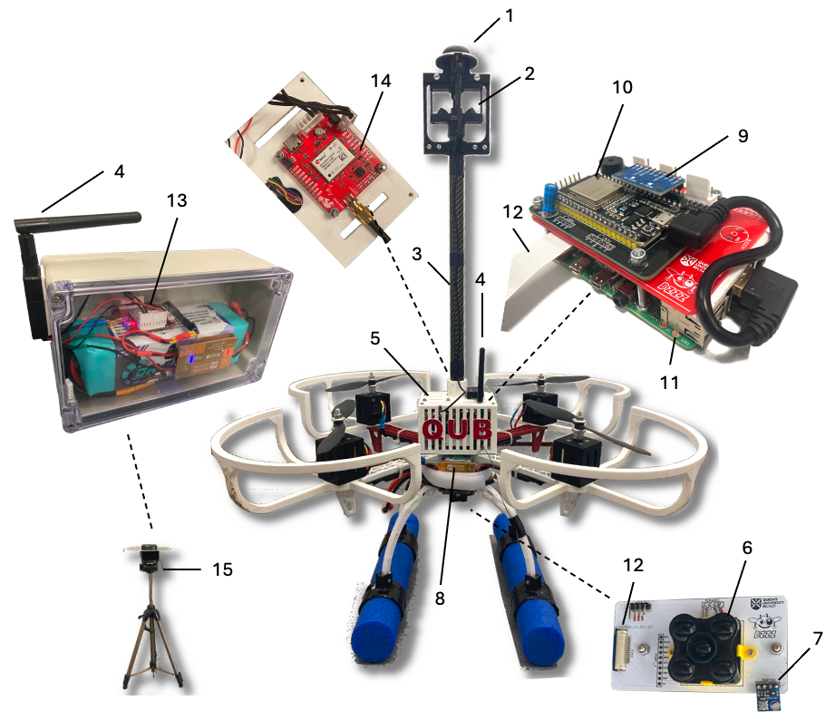
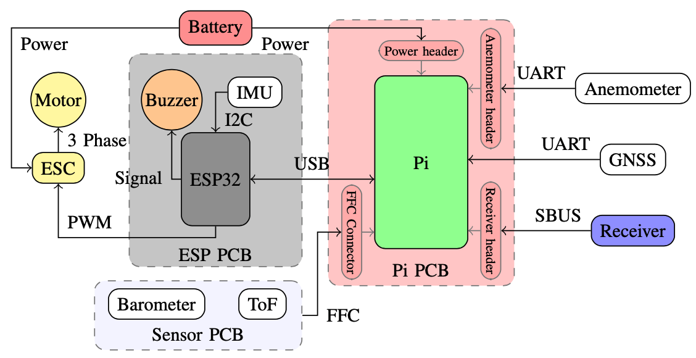

<em>Programmable quadcopter with ESP32 and RaspberryPi</em>

## Project Description

The autonomous systems lab at the school of EEECS of Queens University Belfast (QUB) has designed and built a quadcopter with a stabilising attitude control system and (as of v0.2.0) altitude hold. This is part of an ongoing research project whose objective is the development of control methodologies that will enable quadcopters to fly in extreme weather conditions. Currently, the quadcopter can be operated using a radio controller (RC).

## Getting started

- [Safety first](docs/SAFETY.md): read the safety guidelines
- [Contributing to this project](CONTRIBUTING.md)
- [Setting up software from scratch](docs/SETUP.md)
- [PCB design](design/README.md)
- [ESP32 documentation](include/README.md), [headers](./include) and [sources](./src)
- [Raspberry Pi code](raspberry/README.md)
- [Create a Discord bot](raspberry/DiscordBot/README.md)
- [Changelog](CHANGELOG.md)

## Design

The structure of the quadcopter is shown below

The parts shown in the figure are: 1. GNSS L1/L2 antenna, 2. 3D anemometer, 3. Carbon fibre pole, 4. Telemetry radio pair, 5. Box with electronics (Raspberry Pi, ESP32, IMU, GNSS module, radio receiver module), 6. Time-of-flight altimeter, 7. Barometer, 8. LiPo battery and UBEC, 9. IMU, 10. ESP32 microcontroller (attitude control system), 11. Raspberry Pi, 12. Interface between Raspberry Pi and sensors board, 13. Base station GNSS module, 14. GNSS module on the vehicle (inside the box), 15. Base GPS station.

A high-level schematic of the quadcopter with all its basic modules is shown below:

An ESP32 microcontroller is connected to an MPU9250 9-axis IMU and runs the attitude controller. 
A Raspberry Pi 4B computer is connected to a number of sensors (e.g., time-of-flight altimeter,
GPS module, and anemometer) and can run high-level tasks such as 
altitude and position control.
An RC receiver is connected to the Raspberry Pi and provides the commands of the operator.
The Raspberry Pi and the ESP32 microcontroller are connected with a USB and this allows
a bidirectional communication: the Raspberry sends tilt and throttle references to the 
ESP32 which in turn provides IMU measurements to the Raspberry Pi. 

## How to Fly 
*This is the current set up for how to fly the quadcopter*

- Make sure the quadcopter is in a safe place to fly
- Power on the battery
- Turn on the remote and wait to connect
- Arm the quadcopter by switch B
- Fly safely
- Switch D kills the quadcopter

## Videos 

Testing altitude hold of bzzz:

First flight of bzzz:

Preliminary tests in the lab:

