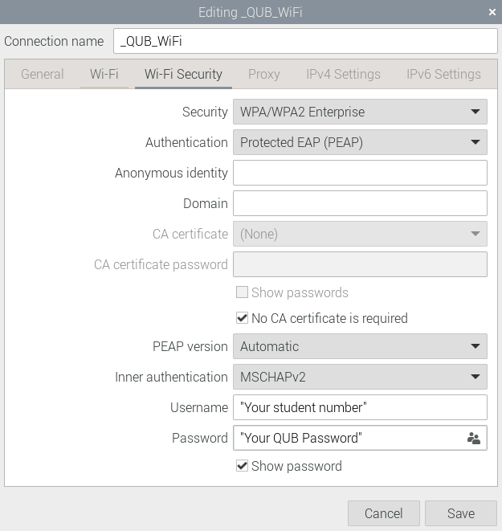

# Software Set Up (THIS IS CURRENTLY A DRAFT)
This documentation includes the relevant information on how to set up the software frome scratch.

The following software has been tested on Raspberry Pi OS (32-bit) bookworm with Python 3.11.2 and pip 23.0.1 


## Raspberry Pi OS
The Raspberry Pi OS can be installed on a usb stick or SD card by using the Raspberry Pi Imager as described [here](https://www.raspberrypi.com/software/).

We recomend using Raspberry Pi OS (32-bit) bookworm as it the most recent version we have tested on.

When switching on the Raspberry Pi for the first time there will be a short setup stage. For QUB students use the same password used for the other Raspberry Pi
(if unsure ask a team member), for continuity across all our devices.

## Raspberry Pi Configuration
To be able to access some of the GPIO pins properly the Pi must be configured.

First of all, if you haven't already connect the Raspberry pi to the internet.

For QUB students see the image below. (This could take a few attempts)



- Run the following
```
sudo raspi-config
```
- Select **3 Interface options**
- Select **4 I2C**
- Select **Yes**

* Select **3 Interface options**
*  Select **5 Serial port**
*  Select **No**
*  Select **Yes**

- Select **3 Interface options**
- Select **1 SSH**
- Select **Yes**

Next run
```
sudo nano /boot/firmware/config.txt
```
Add the following to the end of the file and save.
```
arm_64bit=0
```
Then reboot
```
sudo reboot
```


## git for collaborators
This section is for collaborators when setting up a new Raspberry Pi. Open a new terminal and carry out the following.

First the users name and email needs to be add this can be done by editing and running the following.
```
git config --global user.email "you@example.com"
```
```
git config --global user.name "Your Name"
```

Next you need to specify how to reconcile divergent branches.
```
git config --global pull.rebase true
```

Next an SSH key needs to be generated and added to the ssh-agent and GitHub account.

To generate an SSH key copy and paste the text below, substituting in your GitHub email address.

```
ssh-keygen -t ed25519 -C "your_email@example.com"
```
When prompted to "Enter a file in which to save the key", you can press Enter to accept the default file location.

When prompted to "Enter passpharse", type the same passpharse used for the other devices on this project for continuity (if unsure ask a team member).

When prompted to "Enter same passpharse again", Enter same the passpharse as before.

To add the SSH key to the ssh-agent run the following
```
ssh-add ~/.ssh/id_ed25519
```
for more information on Generating a new SSH key and adding it to the ssh-agent visit [here](https://docs.github.com/en/authentication/connecting-to-github-with-ssh/generating-a-new-ssh-key-and-adding-it-to-the-ssh-agent)

To add the SSH key to your GitHub account follow the [guide line](https://docs.github.com/en/authentication/connecting-to-github-with-ssh/adding-a-new-ssh-key-to-your-github-account)

After all the above steps are complete run the following 
```
git clone git@github.com:QUB-ASL/bzzz.git
```


## Users
If you are looking to use our software, run the following 
```
  git clone https://github.com/QUB-ASL/bzzz.git
```


## Dependencies
There are a few packages that can not be installed in the virtual environment by `pip` therfore should be instaled system wide.

To do this run
```
sudo apt-get install libopenblas-dev
sudo apt-get install libatlas-base-dev
```


## virtual environment
Next a virtual environment can be created by (we have tested this with Python 3.11.2):
```
python -m venv venv_bzzz
```
For older versions of python use:
```
virtualenv -p python3 venv_bzzz
```

Then, activate the virtual environment
```
source  venv_bzzz/bin/activate
```

and install the requaried packages.
```
cd bzzz/raspberry
pip install .
```

Now the `main.py` script can be ran by:
```
sudo pigpiod
python main.py
```


## How to run the main Raspberry Pi code on start-up
After the virtual environment and dependencies have been installed as described above, a script can be used to atuomatically run the main Raspberry
Pi code on start-up.

To do this, the `run_main_on_start_up.sh` can be added to the users crontab by:

```
crontab -e
```
Then add the following:

```
@reboot sleep 10 && ~/bzzz/raspberry/run_main_on_start_up.sh
```


## Visual Studio Code
To install VS Code on Raspberry Pi run the following
```
sudo apt update
sudo apt install code
```
For more information visit [here](https://code.visualstudio.com/docs/setup/raspberry-pi)

After VS code is installed, install the following extensions (these may take a while)
* Python
* Platformio

After the correct extensions are installed the ESP32 can be flashed

## Discord Bot 
QUB students should follow the [Discord Bot guidelines](raspberry/DiscordBot) to be able to ssh into the Raspberry Pi.

## How to fly 
