# How to open

1. For quickly viewing the schematic or PCB's, please use the provided `*.png` files. 
2. To open schematic and PCB sources, install and use [EasyEDA](https://easyeda.com/page/download).
3. To view the provided Gerber files, you can use any preferred software. An easy to use software is [Gerbv](https://gerbv.github.io/).

# Schematics & Board layouts

The following images are to scale, to see larger images see `*_x2.5.png` files. 

## ESP board

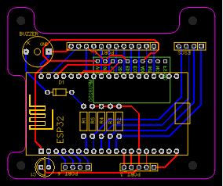

## ESP schematic

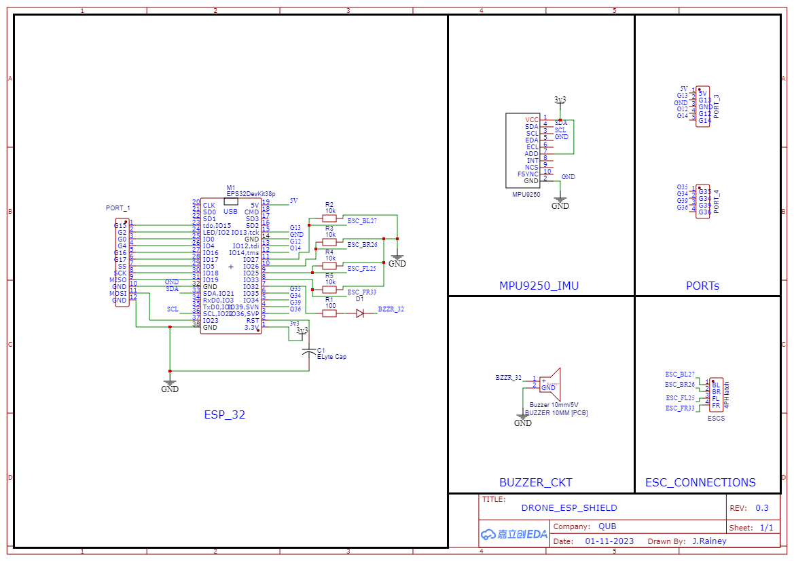

## ESP board with 2 IMU's

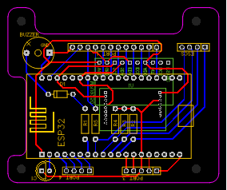

## ESP schematic 2 IMU's

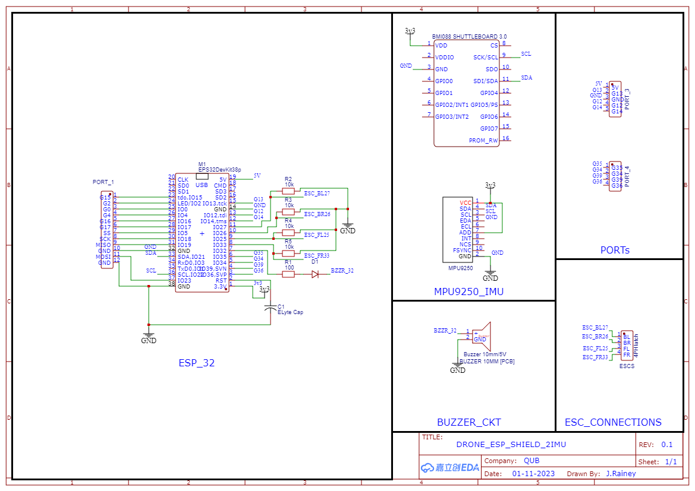

## Pi board with HDMI

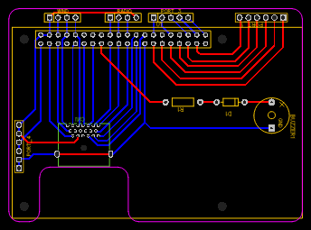

## Pi schematic with HDMI

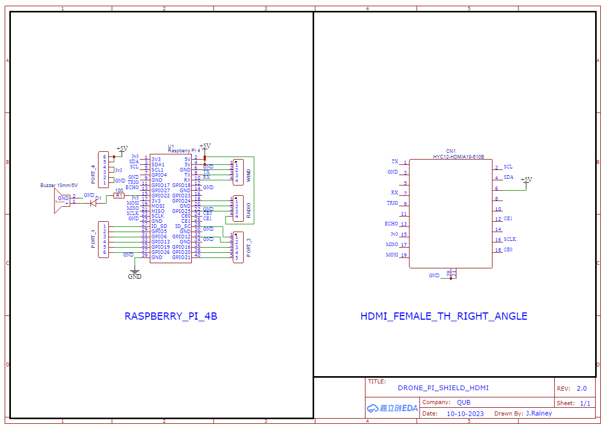

## Pi board with FPC/FFC

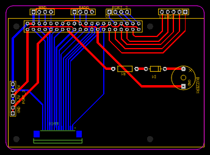

## Pi schematic with FPC/FFC

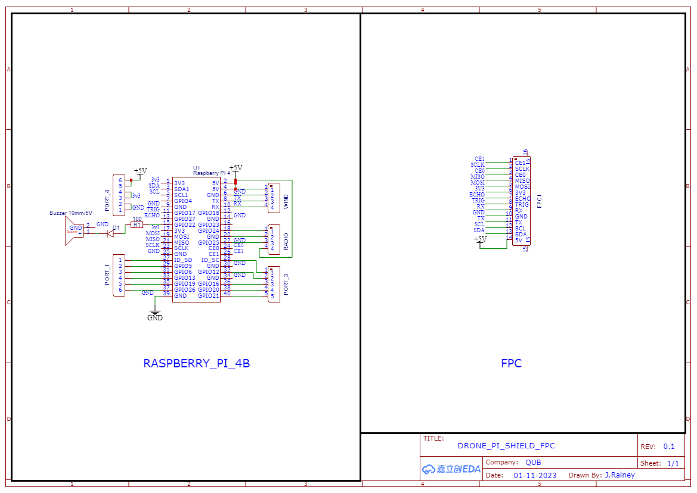

## Sensor Board with HDMI

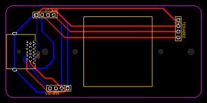

### Sensor schematic with HDMI

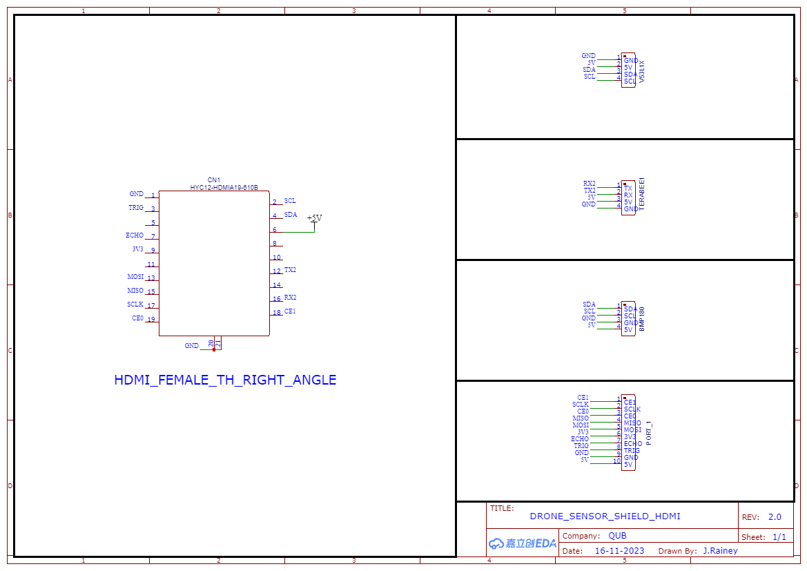

## Sensor Board with FPC/FFC

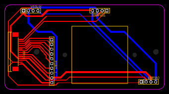

### Sensor schematic with FPC/FFC

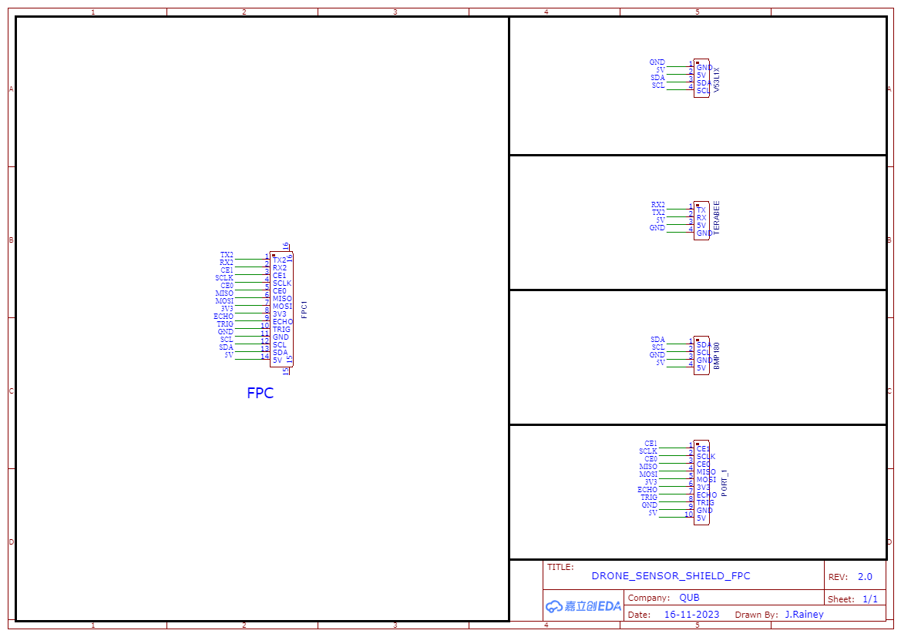
