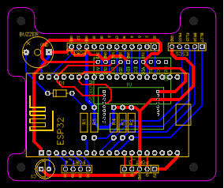
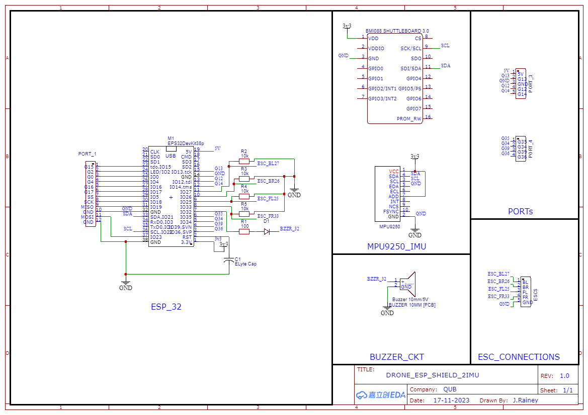
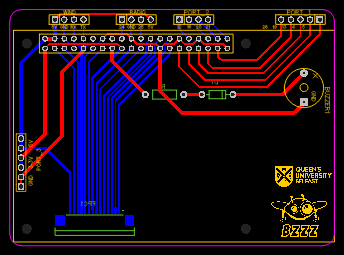
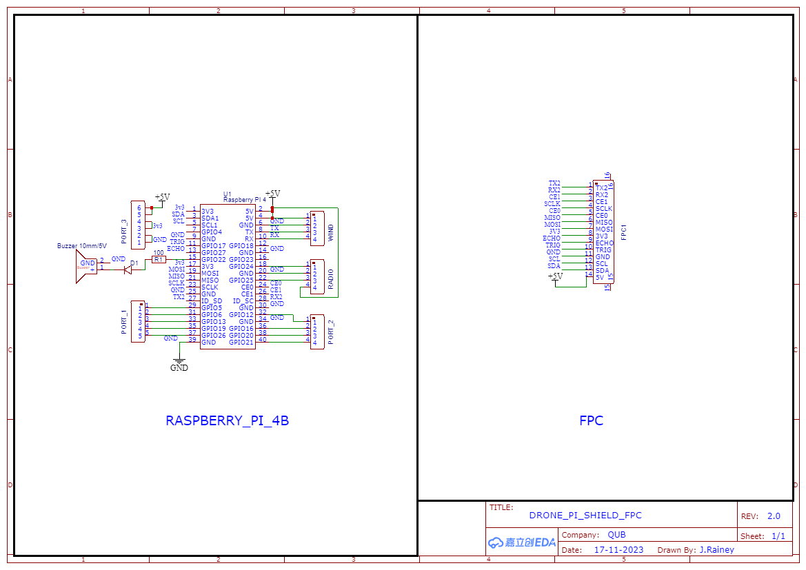
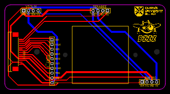

# How to open

1. For quickly viewing the schematic or PCB's, please use the provided `*.png` files. 
2. To open schematic and PCB sources, install and use [EasyEDA](https://easyeda.com/page/download).
3. To view the provided Gerber files, you can use any preferred software. An easy to use software is [Gerbv](https://gerbv.github.io/).

# Schematics & Board layouts

The following images are to scale, to see larger images see `*_x2.5.png` files. 

## ESP board with 2 IMU's

## ESP schematic 2 IMU's

## Pi board with FPC/FFC

## Pi schematic with FPC/FFC

## Sensor Board with FPC/FFC

### Sensor schematic with FPC/FFC

#BOM

## Genral Parts

* [Molex KK Crimp Terminal Contact](https://uk.rs-online.com/web/p/crimp-contacts/0467598)
* [PCB Socket long leg 20 x1](https://uk.rs-online.com/web/p/pcb-sockets/2081703)
* [PCB Socket short leg 32 x1](https://uk.rs-online.com/web/p/pcb-sockets/2081707)
* [14 way FFC Ribbon Cable](https://uk.rs-online.com/web/p/ribbon-cable/7635694?gb=s)

## ESP board

* [ESP32](https://www.amazon.co.uk/dp/B0BYMWQT37?_encoding=UTF8&ref_=cm_sw_r_cp_ud_dp_3BHTPX8BNFBTKMHN5VE3&th=1)
* [MPU9250 IMU]
* [BMI088 IMU](https://uk.rs-online.com/web/p/sensor-development-tools/2457082?cm_mmc=UK-PLA-DS3A-_-google-_-CSS_UK_EN_PMAX_Catch+All-_--_-2457082&matchtype=&&gad_source=4&gclid=CjwKCAiAu9yqBhBmEiwAHTx5p9FL-s87i7N0P-j0bJjJdbTe7omJcmibXyPWR6qu7ruucasVfeKdkhoClogQAvD_BwE&gclsrc=aw.ds)
* [BNO055](https://thepihut.com/products/adafruit-9-dof-absolute-orientation-imu-fusion-breakout-bno055?variant=27739963281&currency=GBP&utm_medium=product_sync&utm_source=google&utm_content=sag_organic&utm_campaign=sag_organic&gad_source=4&gclid=CjwKCAiAu9yqBhBmEiwAHTx5pzdU2ze-9KP97st2B0JWUeNqcFlp-qshGu5NTyjn5N5z49Czmh_1bhoCe-oQAvD_BwE)
* [Molex KK Pin Header, 4 X 1](https://uk.rs-online.com/web/p/pcb-headers/4838483)
* [Molex KK Connector Housing 4 x 1](https://uk.rs-online.com/web/p/wire-housings-plugs/6795388)
* [Molex KK Pin Header, 5 X 1](https://uk.rs-online.com/web/p/pcb-headers/4838499)
* [Molex KK Connector Housing 5 x 1](https://uk.rs-online.com/web/p/wire-housings-plugs/6795385)
  
## Pi board

* [Raspberry Pi](https://thepihut.com/products/raspberry-pi-4-model-b?variant=31994565689406)
* [Pi GPIO Header](https://thepihut.com/products/gpio-stacking-header-for-pi-a-b-pi-2-pi-3)
* [Molex KK Pin Header, 4 X 1](https://uk.rs-online.com/web/p/pcb-headers/4838483)
* [Molex KK Connector Housing 4 x 1](https://uk.rs-online.com/web/p/wire-housings-plugs/6795388)
* [Molex KK Pin Header, 5 X 1](https://uk.rs-online.com/web/p/pcb-headers/4838499)
* [Molex KK Connector Housing 5 x 1](https://uk.rs-online.com/web/p/wire-housings-plugs/6795385)
* [Molex KK Pin Header, 6 X 1](https://uk.rs-online.com/web/p/pcb-headers/6795593)
* [Molex KK Connector Housing 6 x 1](https://uk.rs-online.com/web/p/wire-housings-plugs/6795391)
* [14 way FFC Connector](https://uk.rs-online.com/web/p/fpc-connectors/7632578)

## Sensor board

* [Teraranger Evo](https://www.terabee.com/sensors-modules/lidar-tof-range-finders/#individual-distance-measurement-sensors)
* [VL53L0X Time of Flight sensor](https://uk.rs-online.com/web/p/sensor-development-tools/1845087?cm_mmc=UK-PLA-DS3A-_-google-_-CSS_UK_EN_PMAX_Catch+All-_--_-1845087&matchtype=&&gad_source=4&gclid=Cj0KCQiApOyqBhDlARIsAGfnyMogJW5-n7Hy47oy_984a3rkO070Cs7pechJcznmtiaSQt-vjJSGeswaAoiyEALw_wcB&gclsrc=aw.ds)
* [BPM180]
* [Molex KK Pin Header, 4 X 1](https://uk.rs-online.com/web/p/pcb-headers/4838483)
* [Molex KK Connector Housing 4 x 1](https://uk.rs-online.com/web/p/wire-housings-plugs/6795388)
* [14 way FFC Connector](https://uk.rs-online.com/web/p/fpc-connectors/7632578)

