# Parts for 3D printing
The above folders include editable Autodesk Fusion 360 files (.f3d) and STL files that can be 3D printed.

## Anemometer case
This case is to protect the Trisonica Mini ultrasonic wind anemometer that will be attached to the quadcopter.
It also has a stand for attaching the GNSS Antenna. 

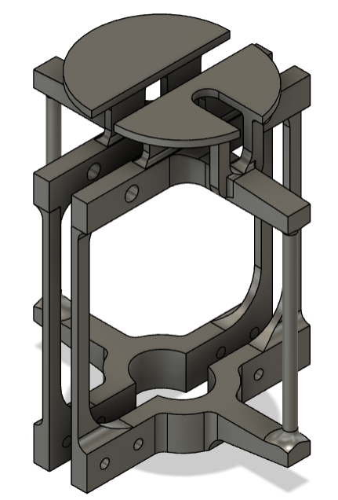

## The following parts are designed for the F450 quadcopter frame

## Controller case
The controller case seen below, is used to house and protect the Raspberry Pi, ESP32 and the associated PCB's and electronics. It is designed to replace the 
F450 quadcopter frames top plate, has holes and slots in the correct place for wires to pass through and has our logo and the universites initials on it.

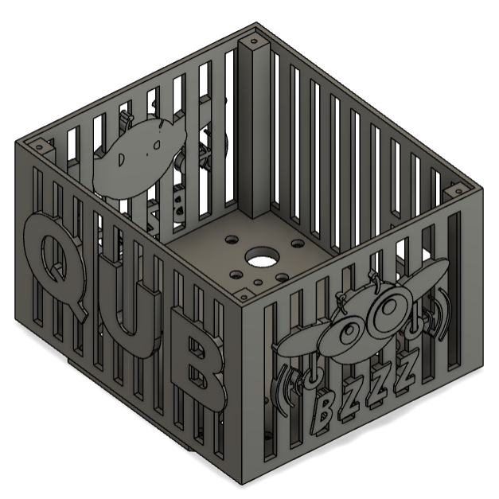

There are 2 controller case lid options, depending if the Anemometer and GNSS module is needed.

The controller case lid below is the plain one which is used if the anemometer and GNSS module is not needed.

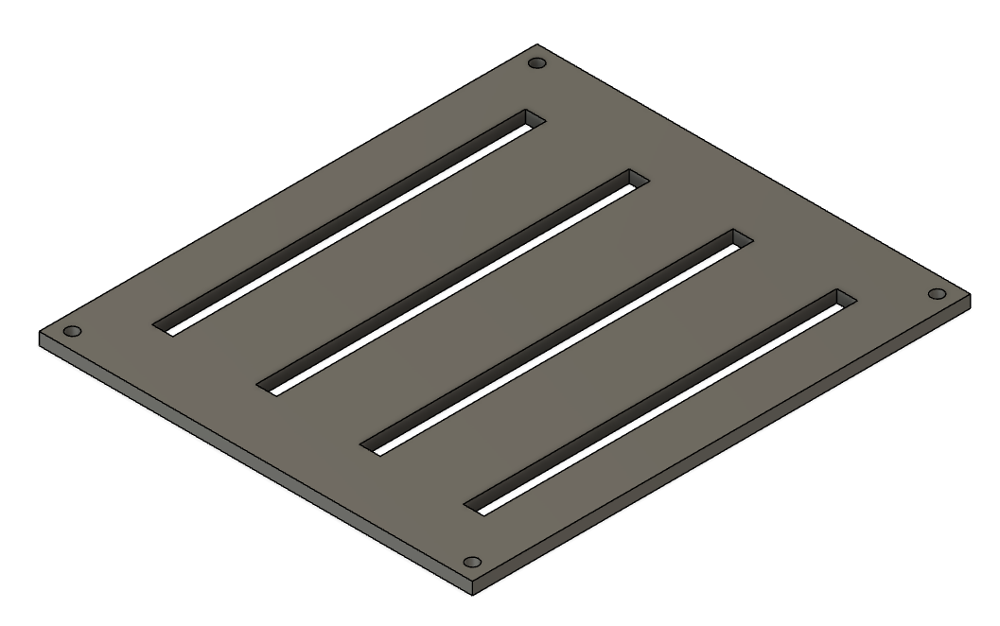

The controller case lid below has a flange that a 22mm pipe can fit in. This is used to attach the anemometer above the quadcopter.
The lid also has holes to attach the appropriate GPS/GNSS modules to the inside of the lid. The photo below shows the controller case lid.

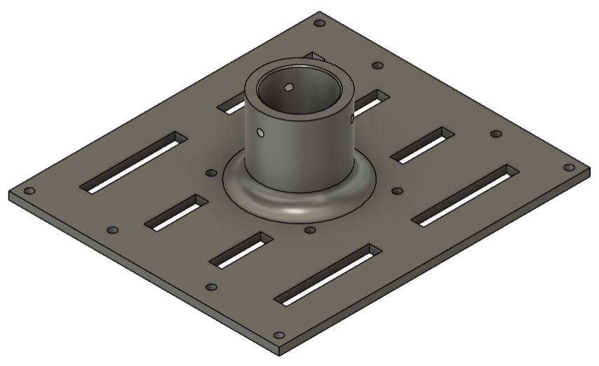

## Motor stands
The 'Non-rotating' motor stand as seen in the photo below is for directly mounting a outrunner motor such as the 
'PROPDRIVE v2 3536' or 'Turnigy Air 3730' to the F450 quadcopter frame.

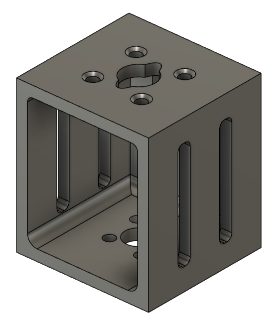

The 'Rotating' motor stand as seen in the photo below is for attaching a rod between two rotating motor stands and mounting the outrunner motors 
to the rod to add an extra degree of fredom to help control the quadcopter. A hole is included in the top so a screw can be put through the rod to 
stop it rotating if needed. The offset hole is for a rod where there holes were not drilled straight.

This set up can be seen in [Altitude Hold Video](https://youtu.be/AMWUkB0SQi4) 

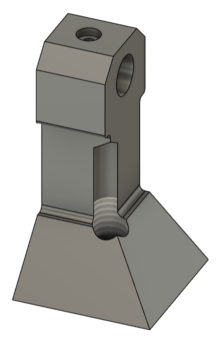

## Propeller guards
Depending on which motor stand is used a different propeller guard will be needed.

If the 'Non-rotating' motor stand is used the 'Symmetrical' propeller guard as seen in the photo below can be used.
To reduce time with 3D printing, it is printed in two halves (top/bottom) then glued and screwed together.

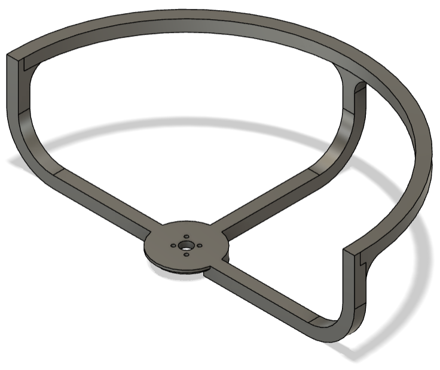

If the 'Rotating' motor stand is used the 'Offset' propeller guard as seen below is used as the motor is no longer directly in centre of the frame.

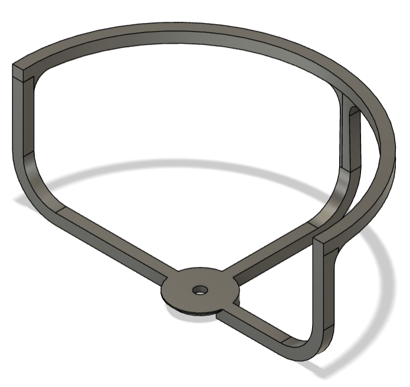

## Frame base support 
This is used to help support the power disturbution board on the base of the quadcopter frame.

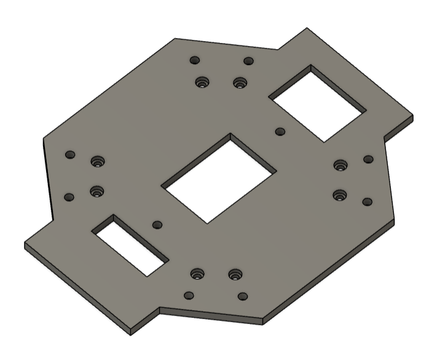

## Leg stand for pool noddle
To attach the pool noddle to the legs of the quadcopter the following stands can be printed. 
These are then glued and screwed to the legs of the quadcopter and the pool nodddle taped onto this stand.

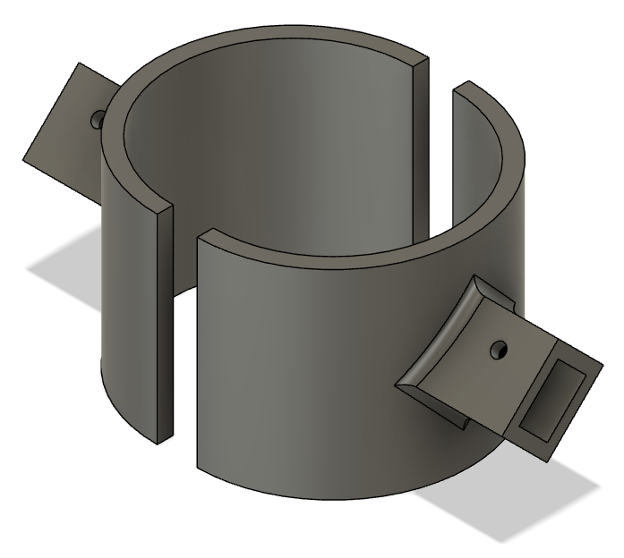

## GNSS and Antenna Parts 

## Base station adapter

The base station adapter is used to attach the base station antenna to a tripod and can be seen in the Photo bellow.

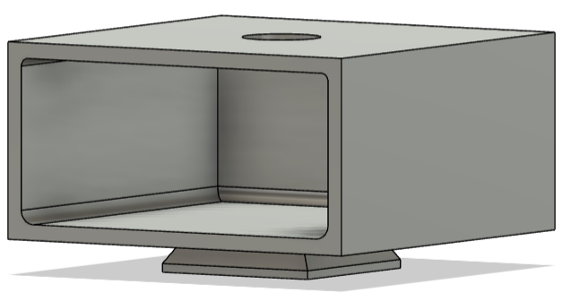
