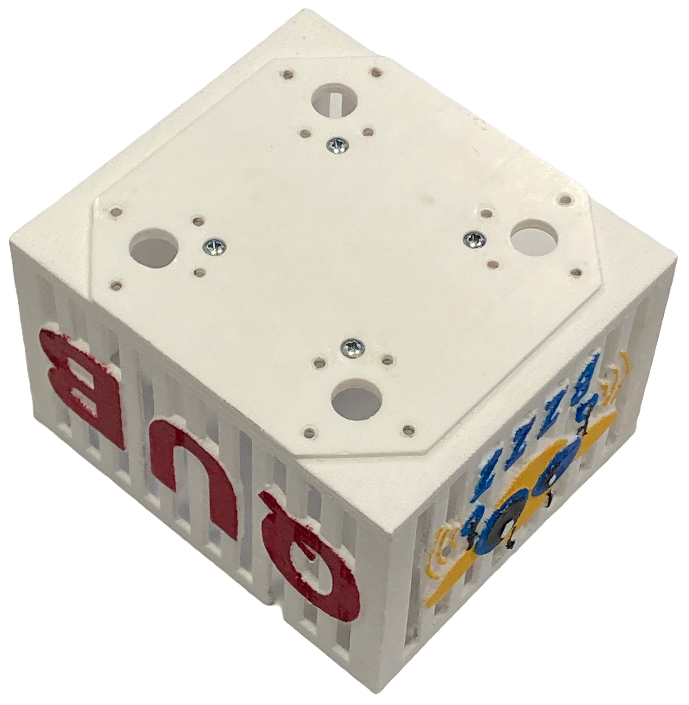
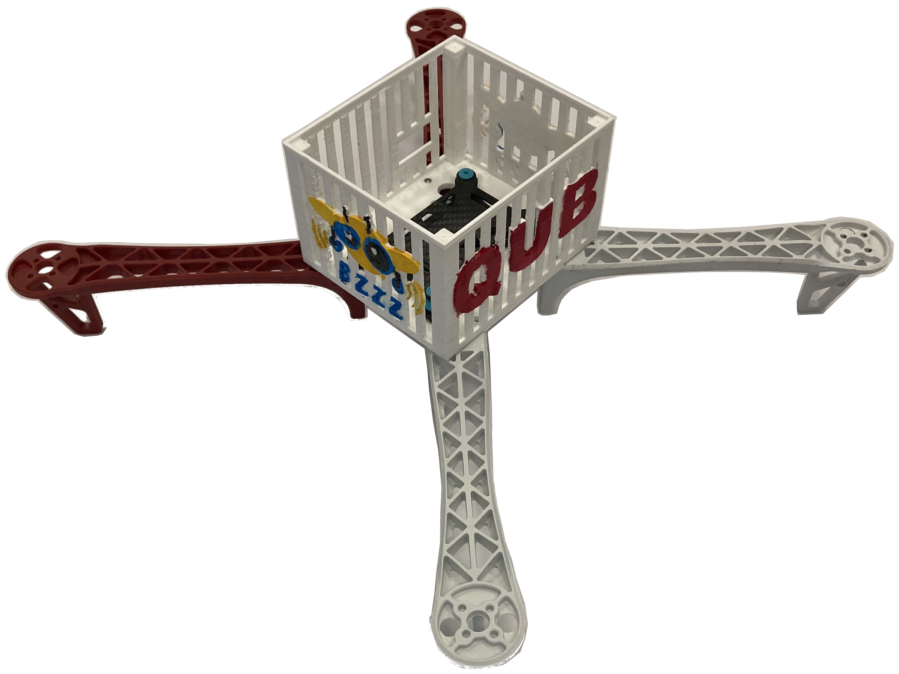
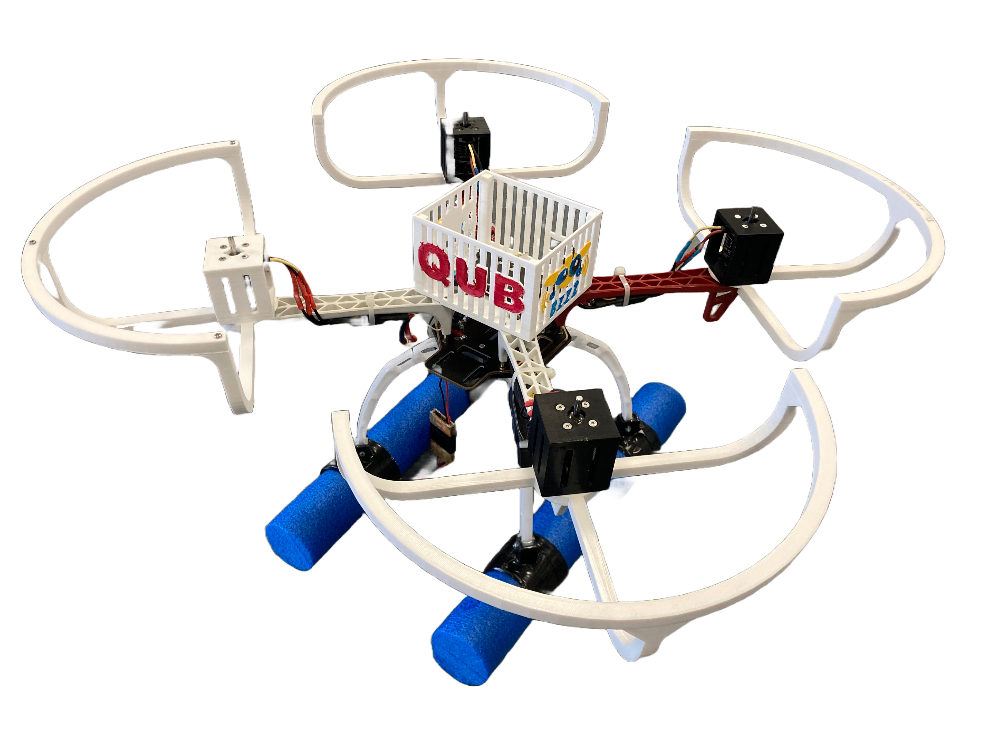

# How to Build bzzz
This documentation includes the relevant information on how to build our quadcopter bzzz from scratch.

## Tools
You will need the following tools to build bzzz.
* Soldering iron with solder
* Crimp tool
* 1.5, 2, 2.5 Allen/Hex keys
* 4mm flat and Phillips 2 screwdrivers
* side cutting pliers
* Pliers
* 4mm, 5mm, 5.5mm, 7mm and 10mm Spanners
* Hacksaw
* Drill with 3mm, 9.5mm and 12mm bits

## Parts  
This section includes all the parts needed to build bzzz and where they can be ordered from (other options available).
You might want to order some spares when initially buying in case of an accident or the product goes out of stock.

### Main Quadcopter parts
| Part | Quantity | approx. price £ |
| --- | ---: | ---: |
|[F450 Frame](https://www.amazon.co.uk/HAWKS-WORK-Quadcopter-Original-version/dp/B09YQ4G4ZZ/ref=sr_1_54?crid=38EJC3Q62CQAA&keywords=drone%2Bframe&qid=1686914495&sprefix=drone%2Bframe%2Caps%2C109&sr=8-54&th=1)|1|22
|[PROPDRIVE v2 3536 1400KV Motor](https://hobbyking.com/en_us/propdrive-v2-3536a-1400kv-brushless-outrunner-motor.html?___store=en_us)|4|75|
|[Skywalker 50A ESC's](https://www.3dxr.co.uk/fixed-wing-c27/fixed-wing-escs-c52/hobbywing-skywalker-50a-v1-ubec-2-4s-p4584)|4|70|
|[1045 Propellers](https://www.amazon.co.uk/Propellers-10x4-5-Flights-Airplane-Adapter/dp/B0848SYBDR/ref=sr_1_3?keywords=1045+propeller&qid=1686927903&sprefix=1045+%2Caps%2C134&sr=8-3)|1|13|
|[Shock Absorber Anti-vibration](https://www.amazon.co.uk/powerday-Absorber-Anti-vibration-Pixhawk-Controller/dp/B07DXFKDDC/ref=sr_1_7?crid=FDJ7Z05X1JZI&keywords=Maxmoral+Flight+Controller+Damping+Board+Anti-Vibration+Shock+Absorber+Plate+Mount+Set+for+Quadcopter+Pixhawk+APM2.5%2F2.6%2FKK%2FMWC&qid=1676933103&sprefix=maxmoral+flight+controller+damping+board+anti-vibration+shock+absorber+plate+mount+set+for+quadcopter+pixhawk+apm2.5%2F2.6%2Fkk%2Fmwc%2Caps%2C72&sr=8-7)|1|5|
|[Pool Noddle/quadcopter feet](https://www.amazon.co.uk/Hillington-Flexible-Swimming-Pool-Noodles/dp/B01MXEKKBG/ref=sxin_17_pa_sp_search_thematic_sspa?content-id=amzn1.sym.c03b262b-067f-42dc-9432-c79b30f89d17%3Aamzn1.sym.c03b262b-067f-42dc-9432-c79b30f89d17&crid=2KA9RKDI37WVC&cv_ct_cx=pool%2Bnoodle&keywords=pool%2Bnoodle&pd_rd_i=B01MXEKKBG&pd_rd_r=f73a7191-0132-431a-9e58-ad8ae1da2108&pd_rd_w=jQuSZ&pd_rd_wg=Czv74&pf_rd_p=c03b262b-067f-42dc-9432-c79b30f89d17&pf_rd_r=534W1N92J9DWCT804BG5&qid=1686873974&sprefix=pool%2Bnoodle%2Caps%2C154&sr=1-3-ad3222ed-9545-4dc8-8dd8-6b2cb5278509-spons&sp_csd=d2lkZ2V0TmFtZT1zcF9zZWFyY2hfdGhlbWF0aWM&th=1&psc=1)|1|15|
|[RadioLink AT10 II RC + R12DS Receiver](https://www.ebay.co.uk/itm/325829598039?chn=ps&_ul=GB&norover=1&mkevt=1&mkrid=710-134428-41853-0&mkcid=2&mkscid=101&itemid=325829598039&targetid=1403035015187&device=c&mktype=pla&googleloc=9045199&poi=&campaignid=19926858371&mkgroupid=155977582267&rlsatarget=pla-1403035015187&abcId=9311017&merchantid=6995734&gad_source=1&gclid=Cj0KCQjwqpSwBhClARIsADlZ_Tmj8YfiYkLlbhdla_tpo2vwVD3eA0HkCdlmdPkm9l2iNycQ_5g0XSIaAmryEALw_wcB)|1|120|
|[LiPo Battery GNB 5500mAh 4S 70C (XT90)](https://www.hobbyrc.co.uk/gnb-5500mah-4s-70c-lipo-battery-xt90)|as req.|(each)50|
|[LiPo Battery GNB 7000mAh 4S 70C (XT90)](https://www.hobbyrc.co.uk/gnb-7000mah-4s-70c-lipo-battery-xt90)|as req.|(each)60|
|[Velcro battery strap](https://www.amazon.co.uk/VELCRO%C2%AE-Brand-ONE-WRAP%C2%AE-double-Strapping/dp/B0777JVG7X/ref=asc_df_B0777LN5VP/?tag=&linkCode=df0&hvadid=375434312298&hvpos=&hvnetw=g&hvrand=4780352683544246738&hvpone=&hvptwo=&hvqmt=&hvdev=c&hvdvcmdl=&hvlocint=&hvlocphy=9045201&hvtargid=pla-815104045675&mcid=7f7f9114cafe36a18ac65f903a162b08&ref=&adgrpid=77211061112&th=1)|1|5|
|Total cost Approximation in GBP including 1 battery||375|

### 3D Printed and Laser cut parts
The following files are what we use for the machines at QUB. If you require a different type of file check [here](https://github.com/QUB-ASL/bzzz/tree/main/design/Parts_for_3D_printing_and_laser_cutting) or create an issue [here](https://github.com/QUB-ASL/bzzz/issues/new?assignees=&labels=question%2Chelp+wanted&projects=&template=questions.yml).
| Part | Quantity |
| --- | ---: |
|[Controller Case](https://github.com/QUB-ASL/bzzz/blob/main/design/Parts_for_3D_printing_and_laser_cutting/Controller_case/Quadrotor_controller_case%20v6.stl)|1|
|[Controller Case Lid](https://github.com/QUB-ASL/bzzz/blob/dev/design/Parts_for_3D_printing_and_laser_cutting/Controller_case/Quadrotor_controller_case_lid_plain%20Drawing.cdr)|1|
|[Motor stand set](https://github.com/QUB-ASL/bzzz/blob/dev/design/Parts_for_3D_printing_and_laser_cutting/Motor_stands/non_rotating_motor_stand_set%20v2.stl)|1|
|[Propeller Guard top half](https://github.com/QUB-ASL/bzzz/blob/dev/design/Parts_for_3D_printing_and_laser_cutting/Propeller_guards/symmetrical_propeller_guard_top_half.stl)|4|
|[Propeller Guard bottom half](https://github.com/QUB-ASL/bzzz/blob/dev/design/Parts_for_3D_printing_and_laser_cutting/Propeller_guards/symmetrical_propeller_guard_bottom_half.stl)|4|
|[Leg stands for pool noddle](https://github.com/QUB-ASL/bzzz/blob/dev/design/Parts_for_3D_printing_and_laser_cutting/Frame_parts/Leg_stand_for_pool_noddle%20v2.stl)|2|
|[Power distribution board support](https://github.com/QUB-ASL/bzzz/blob/dev/design/Parts_for_3D_printing_and_laser_cutting/Frame_parts/Quadcopter_base_suport%20Drawing%20v5.cdr)|1|
|[Controller Case Lid for pole (optional)](https://github.com/QUB-ASL/bzzz/blob/main/design/Parts_for_3D_printing_and_laser_cutting/Controller_case/Quadrotor_controller_case_lid%20v7.stl)|1|
|[Anemometer case (optional)](https://github.com/QUB-ASL/bzzz/blob/dev/design/Parts_for_3D_printing_and_laser_cutting/Anemometer_parts/Amemometer_case%20v6.stl)|1|
|[GNSS Base station antenna adapter (optional)](https://github.com/QUB-ASL/bzzz/blob/dev/design/Parts_for_3D_printing_and_laser_cutting/GPS_and_antenna_parts/Base_station_adapter%20v7.stl)|1|

### Electronics 
| Part | Quantity | approx.. price £ |
| --- | ---: | ---: |
|[Raspberry Pi 4B 4GB](https://thepihut.com/products/raspberry-pi-4-model-b?variant=20064052740158)|1|55|
|[ESP32 Dev](https://www.amazon.co.uk/dp/B0BMPNVYZR?_encoding=UTF8&psc=1&ref_=cm_sw_r_cp_ud_dp_3BHTPX8BNFBTKMHN5VE3)|1|14|
|[SanDisk 128GB USB](https://www.amazon.co.uk/dp/B07855LJ99/ref=twister_B0BMW6CSWS?_encoding=UTF8&th=1)|1|14|
|[MPU9250 IMU](https://www.ebay.co.uk/itm/404535708292?itmmeta=01HT0RPGK67JKM68TTB2JH4BAV&hash=item5e30350a84:g:rsgAAOSwO3tko9sC&itmprp=enc%3AAQAJAAAA4Pbl8Zh0yrOJTcmARopfXnFG2OyInuYaBBNBI9iWtS90l0n2Orj88aRGCVnk%2FbWDGaXPm%2BdIJBCpOMhodEu3GlxECfLCABK%2BIlJrFCZL3mOUYb03aV8Eq1PdQVKQTS2GF7MtAG%2FOpDzuAyAHMUXJn%2BxTny9yoU7Nv1JXfU%2B0bybGexRJMGANGh0a9BYgRQGXDrBt2wVqdOid5u69LclJITWxpNjmZhhfZQc8nL6qBlrNd7AHc9aFQsJs9gkn6iHf690Iyrxdid%2BXDLxwP2fGzJlGDD4jY4EPi9OCvYf576sd%7Ctkp%3ABk9SR9SJ2pjQYw)|1|5|
|[Terabee TR-EVO-60M-I2C (ToF)](https://www.mouser.co.uk/ProductDetail/Terabee/TR-EVO-60M-I2C?qs=OTrKUuiFdkY40qKbhIyQcg%3D%3D&mgh=1&vip=1&utm_id=20797887762&gad_source=1&gclid=CjwKCAjwh4-wBhB3EiwAeJsppHum56FIXwjQGIzYsYOzYrGh84n9l-Po4yk9_-FqA2RmetqPqxtaLBoCNNYQAvD_BwE)|1|113|
|[BMP180 Pressure Sensor](https://www.ebay.co.uk/itm/155842796879?chn=ps&_ul=GB&_trkparms=ispr%3D1&amdata=enc%3A1AzZtnxarQ0qpVL0sCVC_eg53&norover=1&mkevt=1&mkrid=710-134428-41853-0&mkcid=2&mkscid=101&itemid=155842796879&targetid=1647205088800&device=c&mktype=pla&googleloc=9045199&poi=&campaignid=17206177401&mkgroupid=136851690655&rlsatarget=pla-1647205088800&abcId=9300866&merchantid=505743214&gclid=CjwKCAiA44OtBhAOEiwAj4gpOVfMyBkR8TCBzgzfP1dPT0NulDS75gh1xsRwp9gLvtiJUoT9JKTKlxoCJrYQAvD_BwE)|1|3|
|[UBEC Voltage regulator](https://www.3dxr.co.uk/electronics-c78/power-management-c91/voltage-regulators-becs-c101/matek-systems-matek-ubec-duo-4a-5-12v-4a-5v-p2900)|1|20|
|[USB A to Micro USB](https://www.amazon.co.uk/Bolongking-Plated-Angle-angled-Charge/dp/B07KTXJ28G/ref=asc_df_B07KTXJ28G/?tag=googshopuk-21&linkCode=df0&hvadid=326462779181&hvpos=&hvnetw=g&hvrand=3720108917475740690&hvpone=&hvptwo=&hvqmt=&hvdev=c&hvdvcmdl=&hvlocint=&hvlocphy=1006886&hvtargid=pla-657947583815&psc=1)|1|6|
|Total cost Approximation in GBP||230|

### PCBs
We ordered our PCBs from [JLCPCB](https://jlcpcb.com/) (other options available). They have a minimum buy quantity of 5 and a delivery and customs fee of approx £10 - £40 depending on how quickly it needs delivered.
They can have additional offers for first orders etc.

To order from JLCPCB download the .zip files below and upload them to the section "Add gerber file" [here](https://jlcpcb.com/).
| Part | Quantity | approx. price £ |
| --- | ---: | ---: |
|[ESP PCB](https://github.com/QUB-ASL/bzzz/blob/main/design/PCBs/ESP_PCB/ESP_PCB_1_IMU/Gerber_PCB_DRONE_ESP_SHIELD.zip)|5|2|
|[Pi PCB](https://github.com/QUB-ASL/bzzz/blob/main/design/PCBs/PI_PCB/PI_PCB_FPC/Gerber_PCB_DRONE_PI_SHIELD_FPC.zip)|5|3|
|[Sensor PCB](https://github.com/QUB-ASL/bzzz/blob/main/design/PCBs/SENSOR_PCB/SENSOR_PCB_FPC/Gerber_PCB_DRONE_SENSOR_BOARD_FPC.zip)|5|3|
|Total cost Approximation including delivery and customs in GBP||20 - 30|

### General Parts (Screw and Headers etc)
You may want to order extra screws and headers in the case of needing to replace them due to damages or accidents and it works out cheaper per an item (other options available).
| Part | Quantity | approx. price £ |
| --- | ---: | ---: |
|[Double-sided tape](https://cpc.farnell.com/pro-power/adsft19x10/tape-double-sided-foam-19mm-x/dp/CB20010)|1|2.9|
|[M3 x 8mm Socket Countersunk Screws](https://www.accu.co.uk/countersunk-socket-head-screws/5423-SSK-M3-8-A2)|24|2.2|
|[M3 x 20mm Hex Cap Screws](https://www.accu.co.uk/metric-cap-head-screws/2802-SSC-M3-20-A2)|50|3|
|[M3 x 30mm Pozi Pan Screws ](https://www.accu.co.uk/pozi-pan-head-screws/9278-SPP-M3-30-A2)|12|2|
|[M3 x 6mm Slotted Pan Head Screws](https://www.accu.co.uk/metric-pan-head-screws/6965-SFP-M3-6-A2)|6|1.3|
|[M3 x 6mm Hex Grub Screws](https://www.accu.co.uk/cup-point-set-screws/5011-SSU-M3-6-A2)|6|1.5|
|[M3 Lock Nuts](https://www.accu.co.uk/hexagon-nylon-locking-nuts/7944-HNN-M3-A2)|box of 50|2.5|
|[M3 Washers](https://uk.rs-online.com/web/p/washers/4899488)|box of 200|3|
|[M2.5, 15mm standoff](https://uk.rs-online.com/web/p/standoffs/2052955)|box of 10|6|
|[M2.5 x 14mm Hex Cap Screws](https://www.accu.co.uk/metric-cap-head-screws/3808-SSCF-M2-5-14-A2)|12|1.8|
|[M2.5 x 10mm Slotted Pan Screws](https://www.accu.co.uk/metric-pan-head-screws/6954-SFP-M2-5-10-A2)|12|1.7|
|[M2.5 Washers](https://uk.rs-online.com/web/p/washers/0560322)|box of 250|3.4|
|[M2.5 Nuts](https://uk.rs-online.com/web/p/hex-nuts/6934889)|box of 50|2.3|
|[M2 x 10mm Pozi Pan Screws](https://www.accu.co.uk/pozi-pan-head-screws/9244-SPP-M2-10-A2)|2|1.3|
|[M2 Nuts](https://uk.rs-online.com/web/p/hex-nuts/6934886)|box of 50|2.3|
|[No.4 x 3/4 inch Pozi Self Tapping Screws](https://www.accu.co.uk/pozi-self-tapping-flanged-button-screws/403323-SPBFT-No-4-3-4-A2)|24|2.9|
|[Molex KK Crimp Terminal Contact](https://uk.rs-online.com/web/p/crimp-contacts/0467598)|box of 100|15|
|[Molex KK Pin Header, 2 x 1](https://uk.rs-online.com/web/p/pcb-headers/4838461)|box of 10|2.5|
|[Molex KK Pin Header, 4 x 1](https://uk.rs-online.com/web/p/pcb-headers/4838483)|box of 10|3.7|
|[Molex KK Pin Header, 5 x 1](https://uk.rs-online.com/web/p/pcb-headers/4838499)|box of 10|4.7|
|[Molex KK Pin Header, 6 x 1](https://uk.rs-online.com/web/p/pcb-headers/4838506)|box of 10|6|
|[Molex KK Connector Housing 2 x 1](https://uk.rs-online.com/web/p/wire-housings-plugs/6795363)|box of 10|2.3|
|[Molex KK Connector Housing 4 x 1](https://uk.rs-online.com/web/p/wire-housings-plugs/6795388)|box of 10|2|
|[Molex KK Connector Housing 5 x 1](https://uk.rs-online.com/web/p/wire-housings-plugs/6795385)|box of 10|1.8|
|[Molex KK Connector Housing 6 x 1](https://uk.rs-online.com/web/p/wire-housings-plugs/6795391)|box of 10|4|
|[1mm Pitch 14 Way Straight FFC connector](https://uk.rs-online.com/web/p/fpc-connectors/7632578)|box of 5|8.8|
|[1mm Pitch 14 Way FFC cable 20cm](https://www.mouser.co.uk/ProductDetail/Wurth-Elektronik/686714200001?qs=sGAEpiMZZMuuPJj6pSfD6Q4dde1ofFDUsmGX7ZLZjryLo0snSgGnhQ%3D%3D)|1|2.6|
|[GPIO Header for Pi](https://thepihut.com/products/gpio-stacking-header-for-pi-a-b-pi-2-pi-3)|1|2.2|
|[PCB Socket 32 x 1](https://uk.rs-online.com/web/p/pcb-sockets/2081707)|1|3.3|
|[XT-90 Connectors with cable](https://www.amazon.co.uk/Female-Connector-Silicone-RC-Battery/dp/B084M1W4ZH/ref=sr_1_7?crid=3L8CEL774VH79&keywords=xt90%2Bconnectors&qid=1676905240&sprefix=xt90%2Caps%2C84&sr=8-7&th=1)|1|11|
|[24AWG 10 colour wire kit](https://cpc.farnell.com/velleman-sa/k-mow/wire-kit-8x5m-2x10m-24awg-multicore/dp/MK00170)|1|11.3|
|[Heat shrink kit](https://www.amazon.co.uk/Eventronic-Connectors-Heatshrink-Electrical-User-Friendly/dp/B071D7LJ31/ref=sr_1_1_sspa?crid=GOANSWH3J74I&dib=eyJ2IjoiMSJ9.nas3_52vcamFpgTE5DevT9iUU3cEFQcmVkukqXiAoq3Ty_OsEfNLe8Cl7laBo8E9pQYSloWvchRpVhwHWzE0G7ZbakXaNu-t3sJTmKCBAV8uXKBkwFb_8HOtTp_Rm-wm8p47laXPgwfSjRmuwqDpk9eAuKgODQp6970mNGYb7CzKEZwLe1z07TMkhWh6ccfm_kwdwFNpsv7KH2fSYckGwkj1ZDbzmnXEHyXBmBGtZR4RNAYgMcHneBsr3jA4SzpUdKH0AgzC_mCAbkPIFIGtQAZNuU_oVbuCgQtObIDewu0.-KrNP69tuSqZD1dFQW6oUuV0nvfcAJHR40ZMxSGj2GU&dib_tag=se&keywords=heat+shrink&qid=1712931516&sprefix=heat+shrink+%2Caps%2C76&sr=8-1-spons&sp_csd=d2lkZ2V0TmFtZT1zcF9hdGY&psc=1)|1|8.5|
|Total cost Approximation in GBP||130|

### Optional Anemometer and GNSS
| Part | Quantity | approx. price £ |
| --- | ---: | ---: |
|[Carbon Kevlar Tube](https://www.carbonwebshop.com/carbon-fiber-tubes/carbon-kevlar-tubes/carbon-kevlar-tube-22x20x1000mm/)|1|32|
|[TriSonica Mini LI-550P Anemometer](https://www.licor.com/env/products/trisonica/LI-550-mini)|1|(Ask for Quote) 2000+|
|[SparkFun ZED-F9R GNSS Module (Quadcopter)](https://www.sparkfun.com/products/22660)|1|230|
|[Tallysman 33-SSL889XF L1/L2 GNSS Antenna (Quadcopter)](https://www.mouser.co.uk/ProductDetail/Tallysman/33-SSL889XF-1?qs=HoCaDK9Nz5f3zWqM%252BoQQ1w%3D%3D)|1|150|
|[SparkFun ZED-F9P GNSS Module (Base station)](https://www.sparkfun.com/products/16481)|1|220|
|[Taoglas A.80 L1/L2 GNSS Antenna (Base station)](https://www.mouser.co.uk/ProductDetail/Taoglas/A.80.A.101111?qs=MLItCLRbWsw%252BmeY2bOy8tQ%3D%3D)|1|90|
|[Male SMA Cable (cut to length)](https://uk.rs-online.com/web/p/coaxial-cable/2800560)|1|7|
|[MMCX Connector (solder to above)](https://uk.rs-online.com/web/p/coaxial-connectors/6559952)|1|7|
|[USB A to USB C (Quadcopter)](https://www.amazon.co.uk/Maxhood-Plated-Degree-Converter-Adapter/dp/B077944ZWN?th=1)|1|8|
|[UBEC Voltage regulator](https://www.3dxr.co.uk/electronics-c78/power-management-c91/voltage-regulators-becs-c101/matek-systems-matek-ubec-duo-4a-5-12v-4a-5v-p2900)|1|20|
|[LiPo Battery GNB 8500mAh 4S 70C (XT90)](https://www.hobbyrc.co.uk/gnb-8500mah-4s-150c-dr-1-lipo-battery-xt90)|1|100|
|[HOLYBRO - Telemetry Radio Set](https://www.3dxr.co.uk/radio-gear-c33/telemetry-c31/433-mhz-telemetry-c32/holybro-sik-telemetry-radio-set-v3-100mw-433mhz-p3021)|1|65|
|[M4 x 20mm Slotted Screws](https://www.accu.co.uk/metric-cheese-head-screws/6536-SFE-M4-20-A2)|6|1.6|
|[M4 Lock Nuts](https://www.accu.co.uk/hexagon-nylon-locking-nuts/7946-HNN-M4-A2)|6|1.3|
|[M6 x 20mm Slotted Screws](https://www.accu.co.uk/metric-cheese-head-screws/6579-SFE-M6-20-A2)|2|1.8|
|[M6 Lock Nuts](https://www.accu.co.uk/hexagon-nylon-locking-nuts/7948-HNN-M6-A2)|2|1.3|
|[Toggle switch](https://uk.rs-online.com/web/p/toggle-switches/8610270)|1|4.6|
|[Rubber Grommet](https://uk.rs-online.com/web/p/cable-grommets/0543282)|box of 50|4.6|
|[USB C Power cable](https://www.ebay.co.uk/itm/386091033702?chn=ps&_ul=GB&var=653642543854&_trkparms=ispr%3D1&amdata=enc%3A147TroJCjSXOyvK9tPK50Pg91&norover=1&mkevt=1&mkrid=710-134428-41853-0&mkcid=2&mkscid=101&itemid=653642543854_386091033702&targetid=1647205088320&device=c&mktype=pla&googleloc=9045206&poi=&campaignid=17206177401&mkgroupid=136851690655&rlsatarget=pla-1647205088320&abcId=9300866&merchantid=6995734&gad_source=1&gclid=Cj0KCQjwztOwBhD7ARIsAPDKnkAPtngR6Y7XBFASaQzovt954LrDSIRXm0NWyXWk2WeeTD94yLQFcBsaAiuOEALw_wcB)|1|1.6|
|[Case](https://www.amazon.co.uk/gp/product/B0B2MJH7Q5?ref=ppx_pt2_dt_b_prod_image&th=1)|1|8.6|
|Total cost Approximation in GBP||3000|

### Others
You will need some of these products or an equivalent (e.g. you will need a battery charger), some products are optional. 
| Part | approx. price £ |
| --- | ---: |
|[Lipo Battery Charger](https://www.amazon.co.uk/HobbyInn-B6-Dis-Charge-Function-Charging-Blue/dp/B095HYPSDX/ref=sr_1_8?crid=6B1IZCR8DVAC&keywords=lipo+balance+battery+charger&qid=1684945492&sprefix=lipo+balance+battery+charger%2Caps%2C79&sr=8-8)|37|
|[XT90 Connector to Banana Plugs](https://www.amazon.co.uk/TOOHUI-Connector-Battery-Adapter-Charging/dp/B07JFCS9F4/ref=asc_df_B07JFCS9F4/?tag=googshopuk-21&linkCode=df0&hvadid=232000808334&hvpos=&hvnetw=g&hvrand=15657636691041635122&hvpone=&hvptwo=&hvqmt=&hvdev=c&hvdvcmdl=&hvlocint=&hvlocphy=9045199&hvtargid=pla-617015346847&psc=1)|8|
|[Lipo Safe Bag](https://www.amazon.co.uk/Fireproof-Explosionproof-Battery-Charging-10-63x6-69x6-69/dp/B09TKFP9S5/ref=sr_1_5?keywords=lipo+storage+box&qid=1684946611&sr=8-5)|16|
|[1-8S Cell Checker with Alarm](https://www.hobbyrc.co.uk/1-8s-cell-checker-with-low-voltage-alarm)|3|
|[TP-LINK Sim Wi-Fi Router](https://www.amazon.co.uk/Archer-MR600-Unlocked-Configuration-required/dp/B07S7DMY3H)|120|

## How to build bzzz
Order the relevant parts above.

### Quadcopter Orientation
The photo below shows the orientation of the qaudcopter reletive to the user.

### Header and connector housing labeling orientation
When labeling headers and connector housing, go from left to right. The figures below show the orientation for labeling the headers and connector housing.

### Soldering 
* The following outlines the order components should be soldered, as some components might be covered by others.
* Use heat shrink wrap where necessary.

#### Power disturbution board and ESCs
* Solder ESCs power supply to each corner of the power distribution board.
* Solder XT90 connector and UBEC power supply to the center of the power distribution board.
* Cut the header off the three thin wires (Close to header).
* The black and red thin wires are the BEC outputs and aren't being used excpet 1 black wire (This is needed for a common ground when calibrating the motors). Insulate (cover any copper) the rest and tape them to ESC.

  (if you have a V2 ESC, the yellow wire isn't used either and can be insulate and taped to the ESC)
  
* Crimp or solder Molex KK Terminal Contact to each of the white signal wires coming from each ESC.
* Crimp or solder a Molex KK Terminal Contact to the one black ground wire coming from an ESC (This is needed for a common ground when calibrating the motors).
* Cut of the connectors on the 3 voltage output wire from ESC.
* Temporally solder the 3 voltage output wires from each ESC to any of the wires on each motor (wires might need swapped to change motor spin direction).
* Crimp or solder Molex KK Terminal Contact to the wires on output 1 of the UBEC.

#### ESP PCB 
* Solder header pins on MPU9250 IMU as shown below.
  

All components are to be soldered on the top side of the board.
* Resistors (R1=100Ω, R2-R5=10kΩ).
* Diode (1N4001, Check  polarity).
* Capacitor (10uF, Check  polarity).
* Buzzer (Check  polarity).
* 10 x 1 PCB socket for MPU9250 IMU.
* Molex KK 5 x 1 header for ESCs.

So far the PCB should look as follows
* Cover the resistors and diode components with Kapton or electrical tape.
  

* Solder on the ESP32.
* Cover the bottom of the PCB with Kapton or electrical tape.
* Place IMU in socket with correct orientation as shown below.

#### Pi PCB
These components are soldered on the bottom side of board.
* Resistor and diode (Check polarity of diode).
* Pi GPIO Header (keep legs long).
* 14 x 1 FFC connector.
* Cover the resistor and diode components with Kapton or electrical tape.

These components are soldered on the top side of board.
* 4 x 1 Wind header.
* 4 x 1 Receiver header.
* 6 x 1 Power header.
* Buzzer (Check  polarity).

#### Sensor PCB
* Solder header on BMP180 pressure sensor as shown below.

* Cut and strip the wires of the Evo ToF as shown below (red wire=1, strip 1,2,7,8, remove rest).

All components are soldered on the top side of board.
* 14 x 1 FFC connector.
* BMP180 pressure sensor.
* Evo ToF.
* Attach Evo ToF to sensor PBC with M2 x 10mm bolts and M2 nuts.

 

#### Receiver
* Cut 3 wires approx 20cm long. (signal, power, ground)
* Solder one end of each wire to a 3 x 1 PCB socket in the order: signal, power, ground
* Crimp or solder Molex KK Terminal Contact to the other end of each wire
* Place the terminal contacts from each wire in the correct position of a Molex KK 4 x 1 Connector Housing (Blank, ground, signal, power)
* Push the 3 x 1 PCB socket into the bottom of the receiver (check orientation)

 

### How to Build the Flight Controller
Soldering is complete, the Flight Controller can now be put together.

(You might need to use a round file to make the holes in the PCB slightly bigger).

* Attach 4 M3 x 30mm bolts with M3 nuts onto the bottom of the Pi.
* Add M3 nuts for the Pi PCB to rest on.

* Place the Pi PCB on top of the Pi (Make sure the GPIO header lines up with the pins).
* Add M3 nuts to keep the Pi PCB in place and as a spacer for the ESP PCB.

* Place the ESP PCB on top of the Pi PCB.
* Add M3 nuts to keep the ESP PCB in place.
* Attach the USB A to Micro USB as shown below.

The Flight Controller is now built. With the USB memory stick you can follow the [software setup](https://github.com/QUB-ASL/bzzz/blob/main/docs/SETUP.md) or come back to this at a later stage.

### Screw frame together
* Screw 4 M3 x 6mm screws into the underside of the controller case for the anti-vibration board (you won't be able to access this later).

* Screw the controller case onto the topside of the 4 frame arms (16 M2.5 x 6mm  screws that come with frame).
* Place the anti-vibration board on the 4 screws previously inserted and tighten M3 nuts.

* Attach the 4 legs to the inside countersunk holes of the power distribution board support plate using 8 M2.5 x 12mm bolts, M2.5 washers and M2.5 nuts.

* Attach the sensor board to the power distribution board and support board using 2 of the 15mm long M2.5 standoffs with M2.5 washers and nuts and M2.5 x 14mm screws.
* Attach 8 of the 15mm long M2.5 standoffs to the bottom side of the 4 frame arms (this leaves space for battery).
* Screw the power distribution board and support board to the standoffs on the the 4 frame arms using M2.5 x 14mm screws.

* Place a leg stand for pool noddle in each leg and mark on each leg where the hole needs bored (check orientation is correct).
* Bore out the hole with a 3mm drill bit.
* Attach the leg stands for pool noddle to the bottom of the legs with epoxy resin (or super glue) and M3 x 20mm bolts and M3 nuts.
* Cut pool noddle to length (at least 40cm) x 2.
* Tape each cut pool noddle to the leg stands.

* Attach the top and bottom part of the propeller guards together with M3 x 20mm self tappers and epoxy resin (or super glue).
* Attach a propeller guard and motor stand to each frame arm using the M3x20mm bolts, M3 washers and M3 nuts.
* Attach the motors to the motor stand using the M3 x 8mm countersunk Screws.
* Cable tie the ESCs to the arms of the frame.

* Attach a M3 x 30mm bolts with M3 washers and nuts in each slot at the back of the power distribution board. (These will stop the battery going back too far)
* Place the UBEC flat against the screws mentioned above.
* Add another M3 x 30mm bolts with M3 washers and nuts in each slot to help keep the UBEC in place.
* Put electrical tape around all 4 screw and the UBEC to make sure it is securely attached to the quadcopter.

* Use double sided tape to stick the receiver to inside of the back of the controller case.
* Place the receivers antennas through one of the slots in the controller case and tape cable tie them to the arms or legs approx 90° apart.

  
* Attach the 14 Way FFC cable to the Pi PCB.
* Use double sided tape to stick the flight controller (Pi and ESP) to the anti-vibration plate and place the FFC cable through the slot in the controller case.
* Attach the 14 Way FFC cable to the Sensor PCB.

* Attach the reviver wires to the correct header on the Pi PCB.
* Feed the ESC white signal wires and the single black ground wire through the holes in the controller case.
* Place the terminal contacts from each ESC wires in the correct position of a Molex KK 5 x 1 Connector Housing (Ground, front right, front left, back right back left).
* Attach the ESC connector from the previous step to the correct header on the Pi PCB.
* Feed the wires on output 1 of the UBEC through the holes in the controller case.
* Place the terminal contacts from output 1 of the UBEC in the correct position of a Molex KK 6 x 1 Connector Housing (Power, 4 blanks, Ground).
* Attach the Power (UBEC) connector from the previous step to the correct header on the Pi PCB.

* If you haven't already, using the USB memory stick follow the [software setup](https://github.com/QUB-ASL/bzzz/blob/main/docs/SETUP.md).
* Slide the Battery into the gap between the Power disturbution board and controller case, strap it in with the velcro strap and connect it to the XT90 connector.
* Tilt the quadcopter and check that the motors spin as expected for the attitude controller.
* Use the remote and check that the motors spin as expected (If not reverse the remote channel data).
* If needed callibrate the ESCs following [this](https://github.com/QUB-ASL/bzzz/tree/feature/187-docs_on_how_to_build_bzzz/hardware).
* Attach the lid with 4 No.4 x 3/4 self tapping screws.
* Attach the Propellers using the adapters that came with the motors and [fly safely](https://github.com/QUB-ASL/bzzz/blob/feature/187-docs_on_how_to_build_bzzz/README.md#how-to-fly).

### Anemometer
* Cut the carbon fibre tube (at least) 40cm long with a hacksaw (back strokes only).
* Push the carbon tube into the lid and secure it with M3 x 6mm Grub Screw.
* Plug the cable into the anemometer.
* Put the cable down the inside of the carbon tube and attach the anemometer With the North arrow facing forwards with respect to the quadcopter.
* Attach the anemometer case to the carbon tube with M4 and M6 nuts and M4 x 20mm and M6 x 20mm bolts and the GNSS antenna cable slot facing forwards with respect to the quadcopter.
* Cut the cable approx 15cm past the lid.
* Strip the black outside insulator of the cable back 15cm (This leaves the cable more flexible).
* Crimp or solder Molex KK Terminal Contact to the Brown/Burgundy, Light Green and Grey wires.
* Crimp or solder one Molex KK Terminal Contact to the Red and Black wires together.
* Place the terminal contacts from the anemometer in the correct position of a Molex KK 4 x 1 Connector Housing (Power(Brown/Burgundy), Ground(Black and Red), RX(Grey) TX(Light Green)).

### GNSS
#### Prepare the GNSS Modules and Telemetry Radio
* Solder a Molex KK 2 x 1 header to the 5V and Ground on the quadcopter GNSS module (SparkFun ZED-F9R).
* Solder a Molex KK 6 x 1 header to the top row that includes the RX2 and TX2 (beside the USB C port) on the quadcopter GNSS module (SparkFun ZED-F9R).

* Solder a Molex KK 5 x 1 header to the righthand header with the Ground, 5V, 3v3, TX2, and RX2 on the Base station GNSS module (SparkFun ZED-F9P).
*In the photo below we have more headers from initial testing*

* Cut the header of the Holybro Telemetry Radio.
* Crimp or solder Molex KK terminal contacts to the 5V, Ground TX and RX of the telemetry radio.
* Put the 5V and Ground Terminal Contacts into the correct position of a Molex KK 2 x 1, or 5 x 1 Connector Housing depending if it is for the quadcopter or base station.
* Put the TX and RX Terminal Contacts into the correct position of a Molex KK 6 x 1, or 5 x 1 Connector Housing depending if it is for the quadcopter or base station.
* Place the Connector Housing onto the correct headers.

#### Quadcopter GNSS 
* Attach the GNSS module to the inside of the lid with the M3 x 20mm bolts and M3 nuts.
* Attach the SMA connector of the cable to the GNSS module.
* Check the length the antenna cable needs to be to go from the GNSS module to the top of the anemometer case (where the antenna will be) and cut it.
* Solder the MMCX connector to the cable.
* Push the MMCX connector into the GNSS antenna (Tallysman 33-SSL889XF).
* Attach the GNSS antenna to the anemometer case with double sided tape, with the North marking facing forwards with respect to the quadcopter (the antenna cable will line up with the slot in the case).

* Attach the Holybro Telemetry Radio on top of the lid with double sided tape.
* Pass the small header of the Telemetry Radio cable through on of the slots in the lid and push it into the telemetry radio.
* Attach the Molex KK 2 x 1 and 6 x 1 connector to the GNSS module.

#### Base station

* Bore a 12mm hole in one of the short sides of the case and a 9.5mm in the other short side.
* Solder the positive of the XT90 connector to one side of the toggle switch.
* Solder the ground of the XT90 connector the ground DC input of the UBEC.
* Solder the other side of the toggle switch to the positive DC input of the UBEC.
* Screw the toggle switch into the 12mm hole.
* Solder the USB C power cable to output 2 (5V) of the UBEC.
* Attach the Base station GNSS module (SparkFun ZED-F9P) to the USB C power connector.
* Pass the anntena cable through the rubber grommet and the 9.5mm hole and connect it to the GNSS Module.
* Connect the 5 x 1 Connector of the Telemetry Radio cable to the GNSS module.
* Pass the small header of the Telemetry Radio cable through the rubber grommet and the 9.5mm hole and connect it to the Holybro Telemetry Radio.
* Attach the Holybro Telemetry Radio to the side of the case with double sided tape.
* Attach the battery to the XT90 connector.
* Use double sided tape to stick the UBEC and GNSS module to a suitable place inside the case.
* Screw the Lid onto the case.

