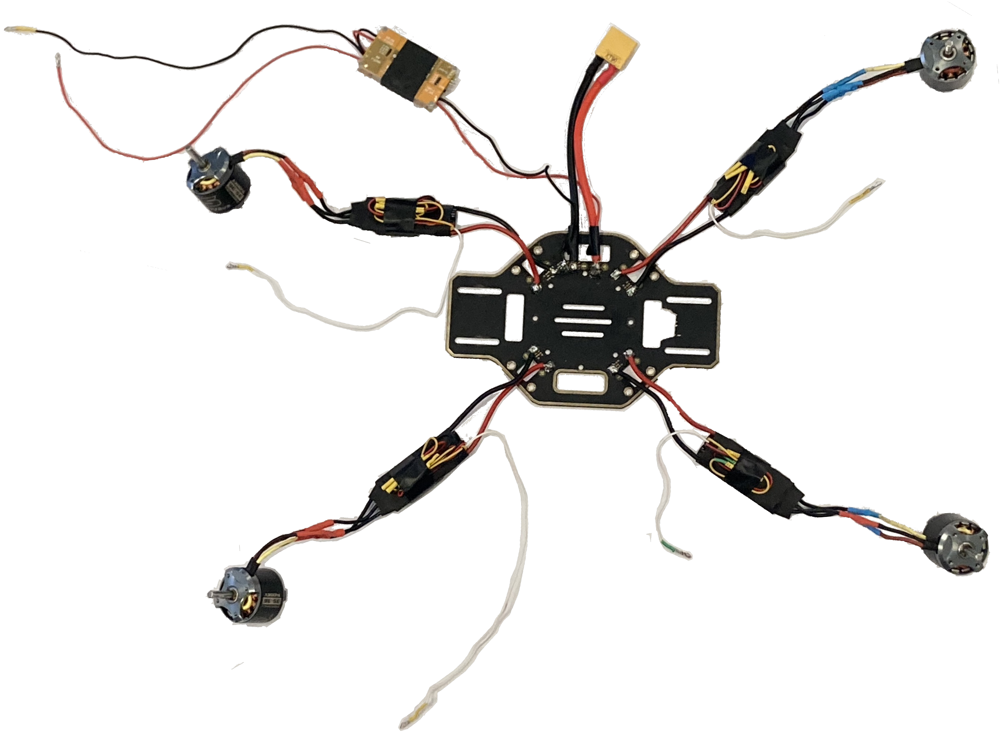
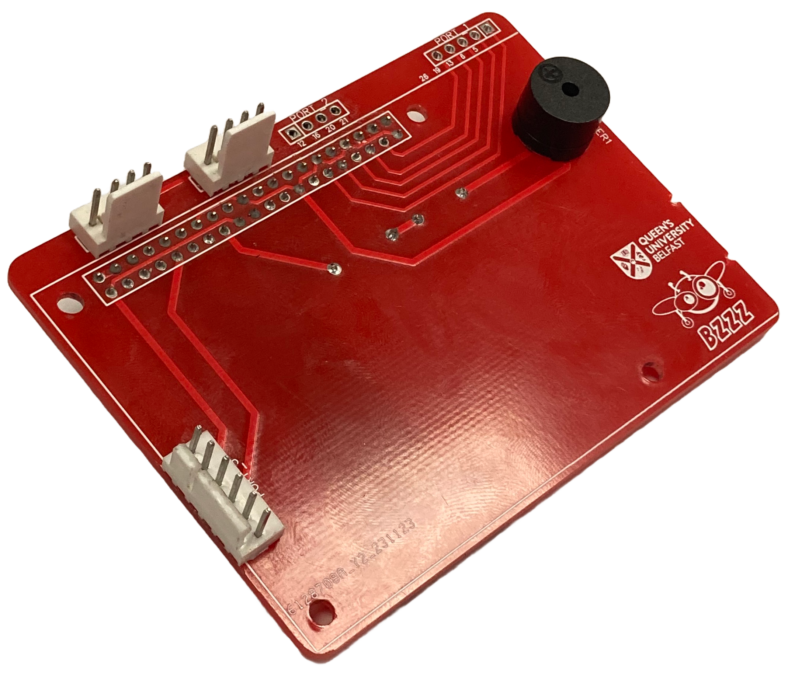
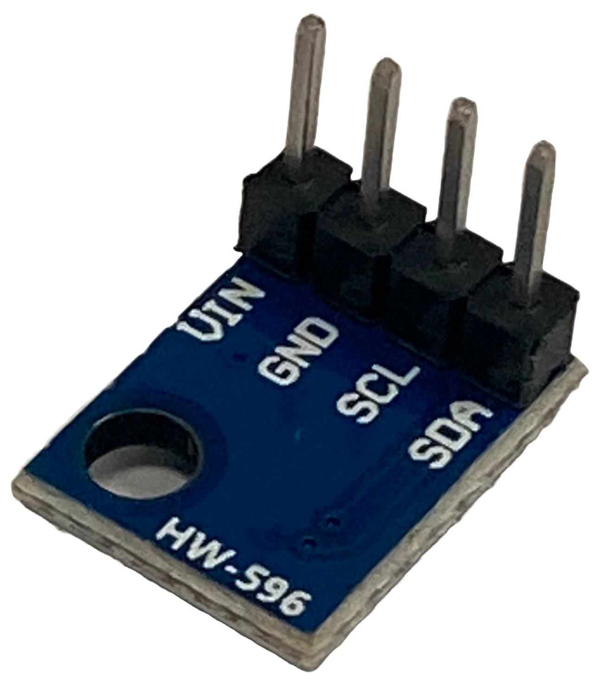

# How to Build bzzz
This documentation includes the relevant information on how to build our quadcopter bzzz from scratch.

## Parts  
This section includes all the parts needed to build bzzz and where they can be ordered from (other options available).
You might want to order some spares when initially buying in case of an accident or the product goes out of stock.

### Main Quadcopter parts
| Part | Quantity | approx. price £ |
| --- | ---: | ---: |
|[DJI F450 Frame](https://www.amazon.co.uk/Drone-Frame-Integrated-Quadcopter-Aircraft/dp/B07N67KQTD/ref=sr_1_2_sspa?keywords=drone+frame&qid=1686871755&sr=8-2-spons&sp_csd=d2lkZ2V0TmFtZT1zcF9hdGY&psc=1)|1|20
|[PROPDRIVE v2 3536 1400KV Motor](https://hobbyking.com/en_us/propdrive-v2-3536a-1400kv-brushless-outrunner-motor.html?___store=en_us)|4|75|
|[Skywalker 50A ESC's](https://www.3dxr.co.uk/fixed-wing-c27/fixed-wing-escs-c52/hobbywing-skywalker-50a-v1-ubec-2-4s-p4584)|4|70|
|[1045 Propellers](https://www.amazon.co.uk/Propellers-10x4-5-Flights-Airplane-Adapter/dp/B0848SYBDR/ref=sr_1_3?keywords=1045+propeller&qid=1686927903&sprefix=1045+%2Caps%2C134&sr=8-3)|1|13|
|[Landing Gear/Frame legs](https://www.unmannedtechshop.co.uk/product/high-landing-gear-for-f450-sk480-f550/?attribute_pa_colour=white-11)|1|4|
|[Shock Absorber Anti-vibration](https://www.amazon.co.uk/powerday-Absorber-Anti-vibration-Pixhawk-Controller/dp/B07DXFKDDC/ref=sr_1_7?crid=FDJ7Z05X1JZI&keywords=Maxmoral+Flight+Controller+Damping+Board+Anti-Vibration+Shock+Absorber+Plate+Mount+Set+for+Quadcopter+Pixhawk+APM2.5%2F2.6%2FKK%2FMWC&qid=1676933103&sprefix=maxmoral+flight+controller+damping+board+anti-vibration+shock+absorber+plate+mount+set+for+quadcopter+pixhawk+apm2.5%2F2.6%2Fkk%2Fmwc%2Caps%2C72&sr=8-7)|1|5|
|[Pool Noddle/quadcopter feet](https://www.amazon.co.uk/Hillington-Flexible-Swimming-Pool-Noodles/dp/B01MXEKKBG/ref=sxin_17_pa_sp_search_thematic_sspa?content-id=amzn1.sym.c03b262b-067f-42dc-9432-c79b30f89d17%3Aamzn1.sym.c03b262b-067f-42dc-9432-c79b30f89d17&crid=2KA9RKDI37WVC&cv_ct_cx=pool%2Bnoodle&keywords=pool%2Bnoodle&pd_rd_i=B01MXEKKBG&pd_rd_r=f73a7191-0132-431a-9e58-ad8ae1da2108&pd_rd_w=jQuSZ&pd_rd_wg=Czv74&pf_rd_p=c03b262b-067f-42dc-9432-c79b30f89d17&pf_rd_r=534W1N92J9DWCT804BG5&qid=1686873974&sprefix=pool%2Bnoodle%2Caps%2C154&sr=1-3-ad3222ed-9545-4dc8-8dd8-6b2cb5278509-spons&sp_csd=d2lkZ2V0TmFtZT1zcF9zZWFyY2hfdGhlbWF0aWM&th=1&psc=1)|1|15|
|[RadioLink AT10 II RC + R12DS Receiver](https://www.ebay.co.uk/itm/325829598039?chn=ps&_ul=GB&norover=1&mkevt=1&mkrid=710-134428-41853-0&mkcid=2&mkscid=101&itemid=325829598039&targetid=1403035015187&device=c&mktype=pla&googleloc=9045199&poi=&campaignid=19926858371&mkgroupid=155977582267&rlsatarget=pla-1403035015187&abcId=9311017&merchantid=6995734&gad_source=1&gclid=Cj0KCQjwqpSwBhClARIsADlZ_Tmj8YfiYkLlbhdla_tpo2vwVD3eA0HkCdlmdPkm9l2iNycQ_5g0XSIaAmryEALw_wcB)|1|120|
|[LiPo Battery GNB 5500mAh 4S 70C (XT90)](https://www.hobbyrc.co.uk/gnb-5500mah-4s-70c-lipo-battery-xt90)|as req.|(each)50|
|[LiPo Battery GNB 7000mAh 4S 70C (XT90)](https://www.hobbyrc.co.uk/gnb-7000mah-4s-70c-lipo-battery-xt90)|as req.|(each)60|
|Total cost Approximation in GBP||380|

### 3D Printed and Laser cut parts
The following files are the files we use for the machines at QUB. If you require a different type of file check [here](https://github.com/QUB-ASL/bzzz/tree/main/design/Parts_for_3D_printing_and_laser_cutting) or create an issue [here](https://github.com/QUB-ASL/bzzz/issues/new?assignees=&labels=question%2Chelp+wanted&projects=&template=questions.yml).
| Part | Quantity |
| --- | ---: |
|[Controller Case](https://github.com/QUB-ASL/bzzz/blob/main/design/Parts_for_3D_printing_and_laser_cutting/Controller_case/Quadrotor_controller_case%20v6.stl)|1|
|[Controller Case Lid](https://github.com/QUB-ASL/bzzz/blob/main/design/Parts_for_3D_printing_and_laser_cutting/Controller_case/Quadrotor_controller_case_lid%20v7.stl)|1|
|[Motor stand set](https://github.com/QUB-ASL/bzzz/blob/dev/design/Parts_for_3D_printing_and_laser_cutting/Motor_stands/non_rotating_motor_stand_set%20v2.stl)|1|
|[Propeller Guard top half](https://github.com/QUB-ASL/bzzz/blob/dev/design/Parts_for_3D_printing_and_laser_cutting/Propeller_guards/symmetrical_propeller_guard_top_half.stl)|4|
|[Propeller Guard bottom half](https://github.com/QUB-ASL/bzzz/blob/dev/design/Parts_for_3D_printing_and_laser_cutting/Propeller_guards/symmetrical_propeller_guard_bottom_half.stl)|4|
|[Leg stands for pool noddle](https://github.com/QUB-ASL/bzzz/blob/dev/design/Parts_for_3D_printing_and_laser_cutting/Frame_parts/Leg_stand_for_pool_noddle%20v2.stl)|2|
|[Power distribution board support](https://github.com/QUB-ASL/bzzz/blob/dev/design/Parts_for_3D_printing_and_laser_cutting/Frame_parts/Quadcopter_base_suport%20Drawing%20v5.cdr)|1|
|[Anemometer case (optional)](https://github.com/QUB-ASL/bzzz/blob/dev/design/Parts_for_3D_printing_and_laser_cutting/Anemometer_parts/Amemometer_case%20v6.stl)|1|
|[GNSS Base station antenna adapter (optional)](https://github.com/QUB-ASL/bzzz/blob/dev/design/Parts_for_3D_printing_and_laser_cutting/GPS_and_antenna_parts/Base_station_adapter%20v7.stl)|1|

### Electronics 
| Part | Quantity | approx.. price £ |
| --- | ---: | ---: |
|[Raspberry Pi 4B 4GB](https://thepihut.com/products/raspberry-pi-4-model-b?variant=20064052740158)|1|55|
|[ESP32 Dev](https://www.amazon.co.uk/dp/B0BMPNVYZR?_encoding=UTF8&psc=1&ref_=cm_sw_r_cp_ud_dp_3BHTPX8BNFBTKMHN5VE3)|1|14|
|[SanDisk 128GB USB](https://www.amazon.co.uk/dp/B07855LJ99/ref=twister_B0BMW6CSWS?_encoding=UTF8&th=1)|1|14|
|[MPU9250 IMU](https://www.ebay.co.uk/itm/404535708292?itmmeta=01HT0RPGK67JKM68TTB2JH4BAV&hash=item5e30350a84:g:rsgAAOSwO3tko9sC&itmprp=enc%3AAQAJAAAA4Pbl8Zh0yrOJTcmARopfXnFG2OyInuYaBBNBI9iWtS90l0n2Orj88aRGCVnk%2FbWDGaXPm%2BdIJBCpOMhodEu3GlxECfLCABK%2BIlJrFCZL3mOUYb03aV8Eq1PdQVKQTS2GF7MtAG%2FOpDzuAyAHMUXJn%2BxTny9yoU7Nv1JXfU%2B0bybGexRJMGANGh0a9BYgRQGXDrBt2wVqdOid5u69LclJITWxpNjmZhhfZQc8nL6qBlrNd7AHc9aFQsJs9gkn6iHf690Iyrxdid%2BXDLxwP2fGzJlGDD4jY4EPi9OCvYf576sd%7Ctkp%3ABk9SR9SJ2pjQYw)|1|5|
|[Terabee TR-EVO-60M-I2C (ToF)](https://www.mouser.co.uk/ProductDetail/Terabee/TR-EVO-60M-I2C?qs=OTrKUuiFdkY40qKbhIyQcg%3D%3D&mgh=1&vip=1&utm_id=20797887762&gad_source=1&gclid=CjwKCAjwh4-wBhB3EiwAeJsppHum56FIXwjQGIzYsYOzYrGh84n9l-Po4yk9_-FqA2RmetqPqxtaLBoCNNYQAvD_BwE)|1|113|
|[BMP180 Pressure Sensor](https://www.ebay.co.uk/itm/155842796879?chn=ps&_ul=GB&_trkparms=ispr%3D1&amdata=enc%3A1AzZtnxarQ0qpVL0sCVC_eg53&norover=1&mkevt=1&mkrid=710-134428-41853-0&mkcid=2&mkscid=101&itemid=155842796879&targetid=1647205088800&device=c&mktype=pla&googleloc=9045199&poi=&campaignid=17206177401&mkgroupid=136851690655&rlsatarget=pla-1647205088800&abcId=9300866&merchantid=505743214&gclid=CjwKCAiA44OtBhAOEiwAj4gpOVfMyBkR8TCBzgzfP1dPT0NulDS75gh1xsRwp9gLvtiJUoT9JKTKlxoCJrYQAvD_BwE)|1|3|
|[UBEC Voltage regulator](https://www.3dxr.co.uk/electronics-c78/power-management-c91/voltage-regulators-becs-c101/matek-systems-matek-ubec-duo-4a-5-12v-4a-5v-p2900)|1|20|
|[USB A to Micro USB](https://www.amazon.co.uk/Bolongking-Plated-Angle-angled-Charge/dp/B07KTXJ28G/ref=asc_df_B07KTXJ28G/?tag=googshopuk-21&linkCode=df0&hvadid=326462779181&hvpos=&hvnetw=g&hvrand=3720108917475740690&hvpone=&hvptwo=&hvqmt=&hvdev=c&hvdvcmdl=&hvlocint=&hvlocphy=1006886&hvtargid=pla-657947583815&psc=1)|1|6|
|Total cost Approximation in GBP||230|

### PCBs
We ordered our PCBs from [JLCPCB](https://jlcpcb.com/) (other options available). They have a minimum buy quantity of 5 and a delivery and customs fee of approx £10 - £40 depending on how quickly it needs delivered.
They can have additional offers for first orders etc.

To order from JLCPCB download the .zip files below and upload them to the section "Add gerber file" [here](https://jlcpcb.com/).
| Part | Quantity | approx. price £ |
| --- | ---: | ---: |
|[ESP PCB](https://github.com/QUB-ASL/bzzz/blob/main/design/PCBs/ESP_PCB/ESP_PCB_1_IMU/Gerber_PCB_DRONE_ESP_SHIELD.zip)|5|2|
|[Pi PCB](https://github.com/QUB-ASL/bzzz/blob/main/design/PCBs/PI_PCB/PI_PCB_FPC/Gerber_PCB_DRONE_PI_SHIELD_FPC.zip)|5|3|
|[Sensor PCB](https://github.com/QUB-ASL/bzzz/blob/main/design/PCBs/SENSOR_PCB/SENSOR_PCB_FPC/Gerber_PCB_DRONE_SENSOR_BOARD_FPC.zip)|5|3|
|Total cost Approximation including delivery and customs in GBP||20 - 30|

### General Parts (Screw and Headers etc)
We order extra screw and headers as we might need to replace them and it works out cheaper per an item.
| Part | Quantity | approx. price £ |
| --- | ---: | ---: |
|[Hex Countersunk Screw M3 x 8mm](https://uk.rs-online.com/web/p/socket-screws/3044918)|box of 50|7|
|[Hex Cap Screw M3 x 20mm](https://uk.rs-online.com/web/p/socket-screws/4733530)|box of 100|10|
|[M3 Lock Nuts](https://uk.rs-online.com/web/p/hex-nuts/0524281)|box of 100|6|
|[Washers](https://uk.rs-online.com/web/p/washers/4899488)|box of 200|3|
|[M2.5, 15mm standoff]()|box of 10|6|
|[Hex Cap Screw M2.5 x 15mm](https://uk.rs-online.com/web/p/socket-screws/4733445)|box of 50|7.7|
|[Molex KK Crimp Terminal Contact](https://uk.rs-online.com/web/p/crimp-contacts/0467598)|box of 100|15|
|[Molex KK Pin Header, 2 x 1](https://uk.rs-online.com/web/p/pcb-headers/4838461)|box of 10|2.5|
|[Molex KK Pin Header, 4 x 1](https://uk.rs-online.com/web/p/pcb-headers/4838483)|box of 10|3.7|
|[Molex KK Pin Header, 5 x 1](https://uk.rs-online.com/web/p/pcb-headers/4838499)|box of 10|4.7|
|[Molex KK Pin Header, 6 x 1](https://uk.rs-online.com/web/p/pcb-headers/4838506)|box of 10|6|
|[Molex KK Connector Housing 2 x 1](https://uk.rs-online.com/web/p/wire-housings-plugs/6795363)|box of 10|2.3|
|[Molex KK Connector Housing 4 x 1](https://uk.rs-online.com/web/p/wire-housings-plugs/6795388)|box of 10|2|
|[Molex KK Connector Housing 5 x 1](https://uk.rs-online.com/web/p/wire-housings-plugs/6795385)|box of 10|1.8|
|[Molex KK Connector Housing 6 x 1](https://uk.rs-online.com/web/p/wire-housings-plugs/6795391)|box of 10|4|
|[1mm Pitch 14 Way Straight FFC connector](https://uk.rs-online.com/web/p/fpc-connectors/7632578)|box of 5|8.8|
|[1mm Pitch 14 Way FFC cable 20cm](https://www.mouser.co.uk/ProductDetail/Wurth-Elektronik/686714200001?qs=sGAEpiMZZMuuPJj6pSfD6Q4dde1ofFDUsmGX7ZLZjryLo0snSgGnhQ%3D%3D)|1|2.6|
|[GPIO Header for Pi](https://thepihut.com/products/gpio-stacking-header-for-pi-a-b-pi-2-pi-3)|1|2.2|
|[PCB Socket long leg 20 x 1](https://uk.rs-online.com/web/p/pcb-sockets/2081703)|1|3.6|
|[PCB Socket short leg 32 x 1](https://uk.rs-online.com/web/p/pcb-sockets/2081707)|1|3.3|
|[XT-90 Connectors with cable](https://www.amazon.co.uk/Female-Connector-Silicone-RC-Battery/dp/B084M1W4ZH/ref=sr_1_7?crid=3L8CEL774VH79&keywords=xt90%2Bconnectors&qid=1676905240&sprefix=xt90%2Caps%2C84&sr=8-7&th=1)|1|11|
|Total cost Approximation in GBP||115|

### Optional Anemometer and GNSS
| Part | Quantity | approx. price £ |
| --- | ---: | ---: |
|[Carbon Kevlar Tube](https://www.carbonwebshop.com/carbon-fiber-tubes/carbon-kevlar-tubes/carbon-kevlar-tube-22x20x1000mm/)|1|32|
|[TriSonica Mini LI-550P Anemometer](https://www.licor.com/env/products/trisonica/LI-550-mini)|1|(Ask for Quote) 2065|
|[SparkFun ZED-F9R GNSS Module (Quadcopter)](https://www.sparkfun.com/products/22660)|1|230|
|[Tallysman 33-SSL889XF L1/L2 GNSS Antenna (Quadcopter)](https://www.mouser.co.uk/ProductDetail/Tallysman/33-SSL889XF-1?qs=HoCaDK9Nz5f3zWqM%252BoQQ1w%3D%3D)|1|150|
|[SparkFun ZED-F9P GNSS Module (Base station)](https://www.sparkfun.com/products/16481)|1|220|
|[Taoglas A.80 L1/L2 GNSS Antenna (Base station)](https://www.mouser.co.uk/ProductDetail/Taoglas/A.80.A.101111?qs=MLItCLRbWsw%252BmeY2bOy8tQ%3D%3D)|1|90|
|[Male SMA Cable (cut to length)](https://uk.rs-online.com/web/p/coaxial-cable/2800560)|1|7|
|[MMCX Connector (solder to above)](https://uk.rs-online.com/web/p/coaxial-connectors/6559952)|1|7|
|[USB A to USB C (Quadcopter)](https://www.amazon.co.uk/Maxhood-Plated-Degree-Converter-Adapter/dp/B077944ZWN?th=1)|1|8|
|[UBEC Voltage regulator](https://www.3dxr.co.uk/electronics-c78/power-management-c91/voltage-regulators-becs-c101/matek-systems-matek-ubec-duo-4a-5-12v-4a-5v-p2900)|1|20|
|[LiPo Battery GNB 8500mAh 4S 70C (XT90)](https://www.hobbyrc.co.uk/gnb-8500mah-4s-150c-dr-1-lipo-battery-xt90)|1|100|
|[HOLYBRO - Telemetry Radio Set](https://www.3dxr.co.uk/radio-gear-c33/telemetry-c31/433-mhz-telemetry-c32/holybro-sik-telemetry-radio-set-v3-100mw-433mhz-p3021)|1|65|
|Total cost Approximation in GBP||3000|

### Others
You will need some of these products or an equivalent (e.g. you will need a battery charger of some sort), some or optional. 
| Part | approx. price £ |
| --- | ---: |
|[Lipo Battery Charger](https://www.amazon.co.uk/HobbyInn-B6-Dis-Charge-Function-Charging-Blue/dp/B095HYPSDX/ref=sr_1_8?crid=6B1IZCR8DVAC&keywords=lipo+balance+battery+charger&qid=1684945492&sprefix=lipo+balance+battery+charger%2Caps%2C79&sr=8-8)|37|
|[XT90 Connector to Banana Plugs](https://www.amazon.co.uk/TOOHUI-Connector-Battery-Adapter-Charging/dp/B07JFCS9F4/ref=asc_df_B07JFCS9F4/?tag=googshopuk-21&linkCode=df0&hvadid=232000808334&hvpos=&hvnetw=g&hvrand=15657636691041635122&hvpone=&hvptwo=&hvqmt=&hvdev=c&hvdvcmdl=&hvlocint=&hvlocphy=9045199&hvtargid=pla-617015346847&psc=1)|8|
|[Lipo Safe Bag](https://www.amazon.co.uk/Fireproof-Explosionproof-Battery-Charging-10-63x6-69x6-69/dp/B09TKFP9S5/ref=sr_1_5?keywords=lipo+storage+box&qid=1684946611&sr=8-5)|16|
|[1-8S Cell Checker with Alarm](https://www.hobbyrc.co.uk/1-8s-cell-checker-with-low-voltage-alarm)|3|
|[TP-LINK Sim Wi-Fi Router](https://www.amazon.co.uk/Archer-MR600-Unlocked-Configuration-required/dp/B07S7DMY3H)|120|

## How to build bzzz
Order the relevant parts above.

### Soldering 
The following outlines the order components should be soldered, as some components might be covered by others.

#### Power disturbution board and ESCs
* Solder ESCs power supply to each corner of the power distribution board
* Solder XT90 connector and UBEC to the center of the power distribution board
* Cut header off the three thin wires (Close to header)
* The black and red thin wires are the BEC outputs and aren't being used. Insulate them (cover any copper) and tape them to ESC

  (if you have a V2 ESC, the yellow wire isn't used either and can be insulate and taped to the ESC)
  
* Solder Molex KK Terminal Contact to each of the white signal wires coming from each ESC
* Place heat sinker on the 3 voltage output wire from ESC and temporally solder each of the motors to an ESC (wires might need swapped to change motor spin direction)
* Solder Molex KK Terminal Contact to the wires on output 1 of the UBEC

#### ESP PCB 
* Solder header pins on MPU9250 IMU as shown below
  

All components are to be soldered on the top side of the board
* Resistors (R1=100Ω, R2-R5=10kΩ)
* Diode (1N4001, Check  polarity)
* Capacitor (10uF, Check  polarity)
* Buzzer (Check  polarity)
* 10 x 1 PCB socket for MPU9250 IMU
* Molex KK 5 x 1 header for ESCs

So far the PCB should look as follows
* You can now cover the resistors and diode components with Kapton or electrical tape
  

* Now solder on the ESP
* You can now cover the bottom of the PCB with Kapton or electrical tape
* Place IMU in socket with correct orientation as shown below

#### Pi PCB
These components are soldered on the bottom side of board
* Resistor and diode (Check polarity of diode)
* Pi GPIO Header (keep legs long)
* 14 x 1 FFC connector
* You can now cover the resistor and diode components with Kapton or electrical tape

These components are soldered on the top side of board
* 4 x 1 Wind header
* 4 x 1 Receiver header
* 6 x 1 Power header
* Buzzer (Check  polarity)

#### Sensor PCB
* Solder header on BMP180 Presure sensor as shown below

* Cut and strip the wires of the Evo ToF as shown below (red wire=1, strip 1,2,7,8, remove rest)

All components are soldered on the top side of board
* 14 x 1 FFC connector
* BMP180 Pressure sensor
* Evo ToF
* Attach Evo ToF to sensor PBC with M2 x 10mm bolts and M2 nuts.

 

#### Receiver

### How to Build the Flight Controller
Now that all the soldering is done, the Flight Controller can be put together.

(You might need to use a round file to make the holes in the PCB slightly bigger.)

* Screw 4 (**NEED TO CHECK SIZE**) onto the bottom of the Pi
* Add M3 nuts for the Pi PCB to rest on

* Place the Pi PCB on top of the Pi (Make sure the GPIO header lines up with the pins)
* Add M3 nuts to keep the Pi PCB in place and as a spacer for the ESP PCB

* Place the ESP PCB on top of the Pi PCB
* Add M3 nuts to keep the ESP PCB in place
* Attach the USB A to Micro USB as shown below

The Flight Controller is now built. With the USB memory stick you can now follow the [software setup](https://github.com/QUB-ASL/bzzz/blob/main/docs/SETUP.md) or come back to this at a later stage.

### Screw frame together
* Screw 4 M3 x 6mm screws into the underside of the controller case for anti-vibration board (you won't be able to access this later).

* Screw controller case onto topside of 4 frame arms (16 M2.5 x 6mm  screws that come with frame).
* Place anti-vibration board on 4 screw previously inserted and tighten nuts.

* Attach the 4 legs to the power distribution board support plate using 8 M2.5 x 15mm bolts, M2.5 washers and M2.5 nuts, to the inside countersunk holes only.

* Attach the sensor board to the power distribution board and support board using (**NEED TO CHECK SIZE**).
* Attach 8 of the 15mm long M2.5 standoffs to the bottom side of the 4 frame arms (this leaves space for battery).
* Screw the power distribution board and support board to the standoffs on the the 4 frame arms using M2.5 x 15mm screws.

${\color{red}PHOTO}$ 

* Place a leg stand for pool noddle in each leg and mark on each leg where the hole needs bored (check orientation is correct).
* Bore out the hole with a 3mm drill bit.
* Attach the leg stands for pool noddle to the bottom of the legs with epoxy resin (or super glue) and M3 x 20mm bolts and M3 nuts.
* Cut pool noddle to length (at least 40cm) x 2.
* Tape each Cut pool noddle to the leg stands.

${\color{red}PHOTO}$ 

* Attach the top and bottom part of the propeller guards together with M3 x 20mm self tappers and epoxy resin (or super glue).
* Attach a propeller guard and motor stand to each frame arm using the M3x20mm bolts, M3 washers and M3 nuts.
* Attach the motors to the motor stand using the M3 x 8mm countersunk Screws.
* Cable tie the ESCs to the arms of the frame.

${\color{red}PHOTO}$ 

* Attach a (**NEED TO CHECK SIZE**) in each slot at the back of the power distribution board. (These will stop the battery going back too far)
* Place the UBEC flat against the screws mentioned above.
* Add another (**NEED TO CHECK SIZE**) in each slot to help keep the UBEC in place.
* Put electrical tape around all 4 screw and the UBEC to make sure it is securely attached to the quadcopter.

${\color{red}PHOTO}$ 

* Use double sided tape to stick the receiver  to inside of the front of the controller case.
* place the receivers antennas through one of the slots in the controller case and tape cablt tie them to the arms or legs approx 90° apart.
* Use double sided tape to stick the flight controller (Pi and ESP) to the anti-vibration plate.
* Attach the reciver wires to the correct header on the Pi PCB.
* Feed the ESC white signal wires through the holes in the controller case.
* Place the terminal contacts from each ESC signal wires in the correct position of the Molex KK 5 x 1 Connector Housing.
* Attach the ESC conector from the previous step to the correct header on the Pi PCB.

