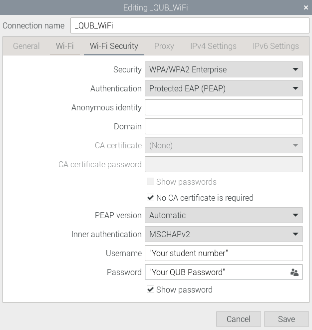

# Software Set Up
This documentation includes the relevant information on how to set up the software from scratch.

The following software has been tested on Raspberry Pi OS (32-bit) bookworm with Python 3.11.2 and pip 23.0.1. 


## Raspberry Pi OS
The Raspberry Pi OS can be installed on a USB stick or SD card by using the Raspberry Pi Imager as described [here](https://www.raspberrypi.com/software/).

We recommend using Raspberry Pi OS (32-bit) bookworm as it the most recent version we have tested on.

When switching on the Raspberry Pi for the first time there will be a short setup stage. For QUB students use the same password used for the other Raspberry Pi (if unsure ask a team member), for continuity across all our devices.

## Raspberry Pi Configuration
To be able to access the GPIO pins properly, the Pi must be configured.

First of all, if you haven't done so already, connect the Raspberry Pi to the Internet.

For QUB students see the image below. (This could take a few attempts)



- Run the following
```
sudo raspi-config
```
- Select **3 Interface options**
- Select **4 I2C**
- Select **Yes**

* Select **3 Interface options**
*  Select **5 Serial port**
*  Select **No**
*  Select **Yes**

- Select **3 Interface options**
- Select **1 SSH**
- Select **Yes**

Next run
```
sudo nano /boot/firmware/config.txt
```
Add the following to the end of the file and save.
```
dtoverlay=uart2
arm_64bit=0
```
Then reboot with
```
sudo reboot
```


## Getting the code from GitHub
If you are looking to use our software, run the following 
```
cd ~
git clone https://github.com/QUB-ASL/bzzz.git
```
This will download all relevant source code into the folder `~/bzzz`.


## Setting up git to push (developers only)
This section is for collaborators only. Open a new terminal and carry out the following.

First, the user's name and email need to be added. This can be done by editing and running the following:
```
git config --global user.email "you@example.com"
git config --global user.name "Your Name"
```

Next you need to specify how to reconcile divergent branches.
```
git config --global pull.rebase true
```

Next an SSH key needs to be generated and added to the ssh-agent and GitHub account.

To generate an SSH key copy and paste the command below, substituting in your GitHub email address.
```
ssh-keygen -t ed25519 -C "your_email@example.com"
```
When prompted to "Enter a file in which to save the key", you can press Enter to accept the default file location.

When prompted to "Enter passpharse", just hit enter without providing a passphrase. When prompted to "Enter same passpharse again", hit enter again.

To add the SSH key to the ssh-agent run the following
```
ssh-add ~/.ssh/id_ed25519
```
for more information on Generating a new SSH key and adding it to the ssh-agent visit [here](https://docs.github.com/en/authentication/connecting-to-github-with-ssh/generating-a-new-ssh-key-and-adding-it-to-the-ssh-agent)

To add the SSH key to your GitHub account follow these [guidelines](https://docs.github.com/en/authentication/connecting-to-github-with-ssh/adding-a-new-ssh-key-to-your-github-account).

After all the above steps are complete run the following 
```
git clone git@github.com:QUB-ASL/bzzz.git
```


## Dependencies
There are a few packages that can not be installed in the virtual environment by `pip`, therefore should be installed system-wide. To install these dependencies, run:
```
sudo apt-get install libopenblas-dev libatlas-base-dev
```


## Virtual environment
All Python code is executed from within virtual environments. We use a virtual environment for the main Python code (e.g., radio interface, attitude control, etc) and a separate environment for the Discord Bots. Next a virtual environment can be created by (we have tested this with Python 3.11.2):
```
python -m venv venv_bzzz
```
For older versions of python use:
```
virtualenv -p python3 venv_bzzz
```

Then, activate the virtual environment:
```
source  venv_bzzz/bin/activate
```
and install the required packages:
```
cd bzzz/raspberry
pip install .
```

Now the `main.py` script can be run by:
```
sudo pigpiod
python main.py
```


## How to run the main Raspberry Pi code on start-up
After the virtual environment and dependencies have been installed as described above, a script can be used to automatically run the main Raspberry
Pi code on start-up.

To do this, the `run_main_on_start_up.sh` can be added to the users crontab by:

```
crontab -e
```
Then add the following:
```
@reboot sleep 10 && ~/bzzz/raspberry/run_main_on_start_up.sh
```


## Visual Studio Code
To install VS Code on Raspberry Pi run the following
```
sudo apt update
sudo apt install code
```
For more information visit [here](https://code.visualstudio.com/docs/setup/raspberry-pi).

After VS Code is installed, install the following extensions (these may take a while)
* Python
* PlatformIO

After the correct extensions are installed the ESP32 can be flashed. 

To do this, connect the ESP32 to the Raspberry Pi via USB then click the arrow in the top right corner or pressing Ctrl+Alt+U.


## How to remote access the Raspberry Pi using Visual Studio Code
It can be useful to access the Raspberry Pi from VS Code on your own device when testing or updating software onboard the quadcopter.

To do this:

* Install the 'Remote - SSH' extension on VS Code on your own device.
* Click on the blue and white inwards-facing arrows in the bottom left corner of VS Code.
* Click Connect to Host...
* Click + Add New SSH Host...
* If connected to _QUB_WiFi type in `ssh [username]@[hostname].qub.ac.uk`[^1]
* Alternatively you can use the username of the Pi followed by the IP Address of the Quadcopter[^2], e.g. `ssh bzzz1@123.456.789`.
* If asked, select the SSH configuration file you want to update.
* Click connect on the pop-up notification (right side of screen)
* When asked to select the platform of the remote host select `Linux`
* Enter the password for the Raspberry Pi

You are now ready to remotely edit the software onboard the quadcopter.


## Discord Bot 
QUB students should follow the [Discord Bot guidelines](../raspberry/DiscordBot) to be able to ssh into the Raspberry Pi.


## You are now ready to fly, go to [How to fly](../README.md#how-to-fly) 

[^1]: Remember you can use the [DiscordBot](../raspberry/DiscordBot) to find the Quadcopter's username and hostname
[^2]: Remember you can use the [DiscordBot](../raspberry/DiscordBot) to find the Quadcopter's IP Address
